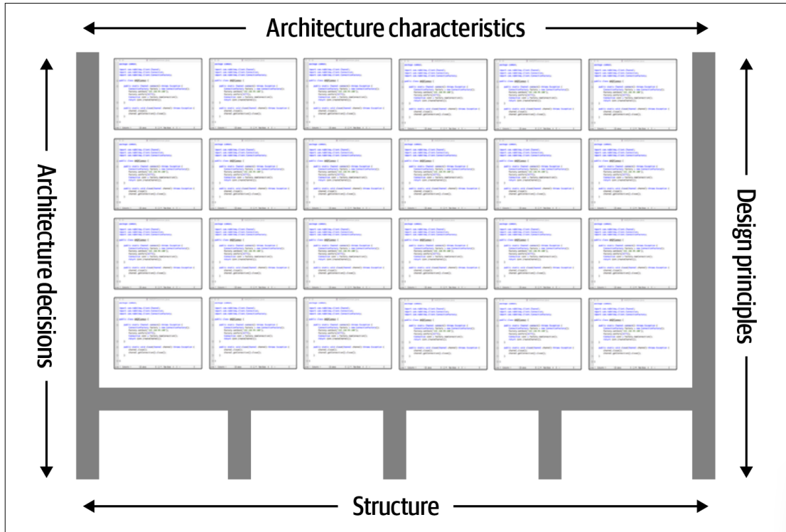
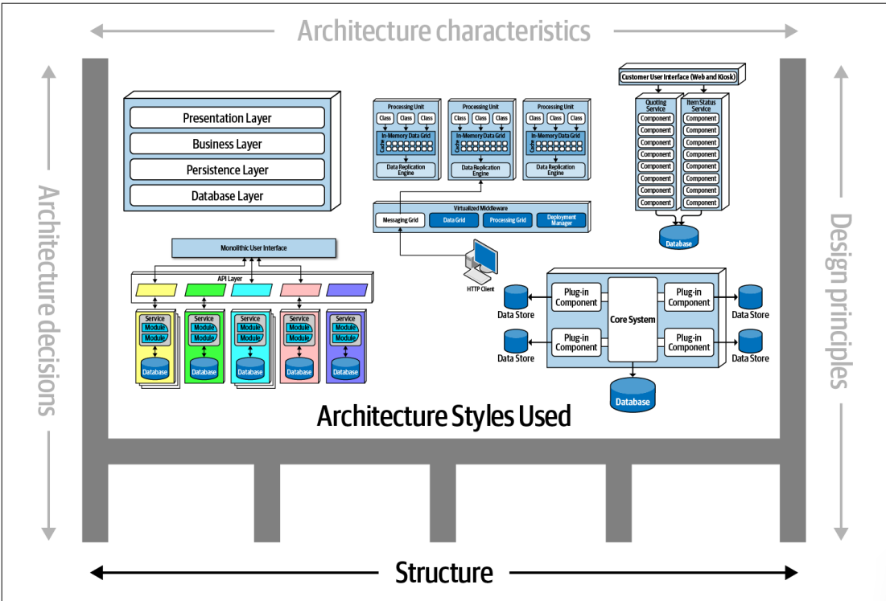
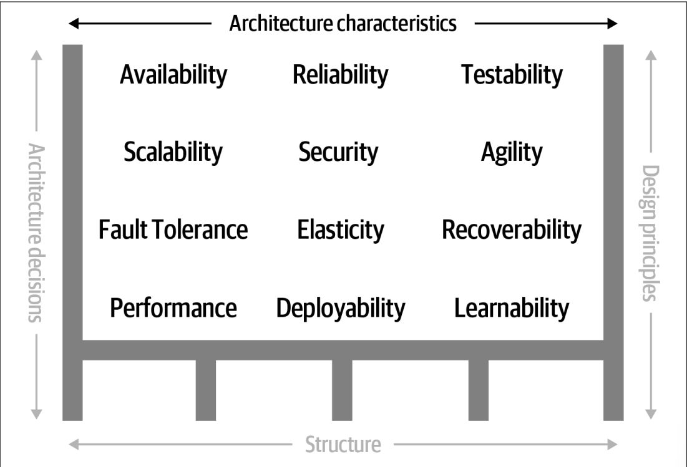
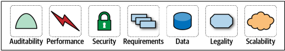

# Chapter One

**شغل “Software Architect” یا معمار نرم‌افزار** در صدر بسیاری از لیست‌های «بهترین مشاغل دنیا» قرار دارد. با این حال، وقتی مخاطبان به مشاغل دیگری که در این لیست‌ها هستند نگاه می‌کنند (مثل پرستار متخصص یا مدیر مالی)، می‌توانند مسیر شغلی مشخصی برای رسیدن به آنها ببینند. اما چرا برای معمار نرم‌افزار چنین مسیری وجود ندارد؟

**اول**، این صنعت حتی تعریف دقیق و یکپارچه‌ای از «معماری نرم‌افزار» ندارد. وقتی کلاس‌های مقدماتی را تدریس می‌کنیم، دانشجویان معمولاً از ما یک تعریف کوتاه و مشخص از کار معمار نرم‌افزار می‌خواهند، اما ما عمداً از ارائه چنین تعریفی خودداری کرده‌ایم — و در این کار تنها نیستیم. *Martin Fowler* در مقاله معروفش **“Who Needs an Architect?”** هم از تعریف دقیق پرهیز کرده و به یک نقل‌قول مشهور اکتفا می‌کند:

> معماری یعنی آن چیزهای مهم… هرچیزی که مهم باشد.

وقتی اصرار کردند که باید توضیح دهیم، یک **mindmap** یا نقشه‌ذهنی (مثل شکل 1-1) ساختیم که البته کامل نیست، ولی وسعت حوزه کاری معماری نرم‌افزار را نشان می‌دهد. البته ما در ادامه‌ی کتاب، تعریف خودمان از معماری نرم‌افزار را هم ارائه خواهیم داد.

**دوم**، همان‌طور که نقشه‌ذهنی نشان می‌دهد، نقش معمار نرم‌افزار طیف وسیعی از مسئولیت‌ها را شامل می‌شود؛ و این دامنه مدام در حال گسترش است. حدود یک دهه پیش، معماران نرم‌افزار بیشتر بر جنبه‌های فنی خالص مثل **modularity، components** و **patterns** تمرکز داشتند. اما به خاطر ظهور سبک‌های جدید معماری مانند **microservices**، این نقش به حوزه‌های بیشتری گسترش یافت و حالا ارتباطات بیشتری با بخش‌های مختلف سازمان پیدا کرده است.

**سوم**، معماری نرم‌افزار یک هدف ثابت و تغییر‌ناپذیر نیست؛ زیرا دنیای توسعه نرم‌افزار به سرعت در حال تحول است. هر تعریفی که امروز ارائه شود، احتمالاً طی چند سال منسوخ خواهد شد. حتی تعریف کنونی در **Wikipedia** هم اگرچه کلیات خوبی دارد، اما بخش‌هایی از آن دیگر درست نیست. مثلاً گفته می‌شود: «معماری نرم‌افزار یعنی انتخاب ساختارهایی که تغییر آنها بعد از پیاده‌سازی، هزینه‌بر است.» ولی سبک‌هایی مثل microservices عمداً طوری طراحی شده‌اند که تغییر ساختار در آنها ساده و کم‌هزینه باشد — البته با هزینه‌هایی در حوزه‌هایی مثل **coupling**. بسیاری از کتاب‌های معماری، آن را مسئله‌ای ایستا می‌بینند که یک‌بار حل شده و بعد می‌توان فراموشش کرد؛ در حالی که ما در این کتاب بر ماهیت **پویا**ی معماری، حتی در تعریف خودش، تأکید می‌کنیم.

**چهارم**، بخش زیادی از مطالب معماری نرم‌افزار امروزه بیشتر ارزش تاریخی دارد تا عملی. صفحه ویکی‌پدیا پر از مخفف‌ها و ارجاعات به مفاهیم تخصصی است، ولی خیلی از آنها مربوط به تلاش‌های شکست‌خورده‌اند. حتی راه‌حل‌هایی که چند سال پیش کاربردی و منطقی بوده‌اند، امروز دیگر جواب نمی‌دهند چون شرایط تغییر کرده است. تاریخ معماری نرم‌افزار پر است از ایده‌هایی که آزمایش شدند و بعدها مشخص شد تبعات منفی دارند. ما در این کتاب، بسیاری از این درس‌ها را مرور می‌کنیم.

## چرا کتابی درباره مبانی معماری نرم‌افزار همین حالا؟

زیرا تغییر، تنها محدود به معماری نیست؛ کل دنیای توسعه نرم‌افزار به‌طور مداوم در حال دگرگونی است. فناوری‌ها، روش‌ها و توانمندی‌های جدید مدام پدیدار می‌شوند. در واقع، راحت‌تر است چیزهایی که تغییر نکرده‌اند را نام ببرید تا فهرست کارهایی که تغییر کرده‌اند. معمار نرم‌افزار باید در این محیط دائماً متغیر تصمیم‌گیری کند. همین تغییرات حتی به اصول بنیادینی که پیش‌تر مبنای تصمیم‌گیری بودند هم سرایت کرده است. به عنوان مثال، بسیاری از کتاب‌های قدیمی‌تر معماری هیچ اشاره‌ای به **DevOps** ندارند، چون آن زمان وجود نداشت.

در مطالعه معماری باید همیشه به خاطر داشت که، مانند یک هنر، فهم آن تنها در **بستر و شرایط خودش** ممکن است. بسیاری از تصمیم‌های معماری گذشته بر اساس واقعیت‌های زمان خود گرفته می‌شدند. مثلاً یکی از اهداف مهم در معماری اواخر قرن بیستم، استفاده حداکثری از منابع مشترک بود، چون همه زیرساخت‌ها گران‌قیمت و اغلب تجاری بودند (سیستم‌عامل‌ها، سرورهای اپلیکیشن، سرورهای پایگاه داده و …).

تصور کنید در سال 2002 به مرکز داده بروید و بگویید: «یک ایده انقلابی دارم؛ معماری‌ای که هر سرویس روی ماشین جداگانه خودش اجرا شود و پایگاه داده مختص خودش را داشته باشد (همین چیزی که امروز microservices می‌نامیم). پس باید 50 لایسنس ویندوز، 30 لایسنس سرور اپلیکیشن و حداقل 50 لایسنس پایگاه داده تهیه کنیم.» آن زمان اجرای چنین ایده‌ای غیرقابل تصور و بسیار پرهزینه بود. اما امروز، با گسترش **open source** و روش‌های مهندسی نوین به کمک **DevOps**، ساخت چنین معماری‌ای منطقی و عملی است.

**در نتیجه**، هر معماری نرم‌افزار محصول شرایط زمانی خودش است.

## تعریف معماری نرم‌افزار

در صنعت نرم‌افزار، هنوز تعریف دقیق و مورد توافقی از «معماری نرم‌افزار» وجود ندارد. بعضی از معماران، آن را *طرح کلی یا blueprint* سیستم می‌دانند، در حالی که برخی دیگر از آن به‌عنوان *نقشه راه* توسعه سیستم یاد می‌کنند. مشکل این تعاریف این است که معلوم نیست دقیقاً این طرح یا نقشه راه شامل چه چیزهایی می‌شود. مثلاً وقتی می‌گوییم یک معمار در حال *تحلیل معماری* است، دقیقاً چه مواردی را بررسی می‌کند؟

در شکلی که با شماره ۱-۲ نشان داده شده، معماری نرم‌افزار به این صورت تعریف شده است: **ساختار سیستم** (مثل اسکلت یا چارچوبی که معماری روی آن قرار می‌گیرد) به‌همراه **ویژگی‌های معماری** (که معمولاً با پسوند “-ilities” بیان می‌شوند، مثل scalability، reliability و غیره)، **تصمیم‌های معماری**، و در نهایت **اصول طراحی**.

## ساختار (Structure)

«ساختار» سیستم، همان‌طور که در شکل ۱-۳ آمده، به سبک یا سبک‌های معماری‌ای اشاره دارد که سیستم با آن‌ها پیاده‌سازی شده است (مثل microservices، معماری لایه‌ای یا microkernel). اگر معماری فقط بر اساس ساختار توصیف شود، تصویر ناقصی به دست می‌آید. به عنوان مثال، اگر از معمار بپرسند «این سیستم چه معماری دارد؟» و او بگوید «معماری مایکروسرویس»، این پاسخ فقط نوع ساختار را مشخص کرده، اما چیز زیادی درباره جزئیات معماری نمی‌گوید. برای شناخت کامل، باید ویژگی‌های معماری، تصمیم‌ها و اصول طراحی آن را هم بدانیم.

## ویژگی‌های معماری (Architecture Characteristics)

ویژگی‌های معماری معیارهایی هستند که موفقیت سیستم را تعیین می‌کنند و معمولاً ربطی به قابلیت‌های عملکردی سیستم ندارند (شکل ۱-۴). مثلاً availability یا maintainability از ویژگی‌هایی هستند که باید پشتیبانی شوند، حتی اگر به عملکرد اصلی سیستم مربوط نباشند. این ویژگی‌ها آن‌قدر مهم‌اند که چند فصل کتاب به بررسی و تعریف دقیق آن‌ها اختصاص دارد.

## تصمیم‌های معماری (Architecture Decisions)

تصمیم‌های معماری، قواعد و محدودیت‌هایی را مشخص می‌کنند که توسعه سیستم باید براساس آن‌ها انجام شود. برای نمونه، ممکن است معمار مشخص کند که در یک معماری لایه‌ای، **فقط** لایه‌های business و service اجازه دسترسی مستقیم به دیتابیس را داشته باشند و لایه presentation نتواند مستقیماً به دیتابیس وصل شود. این تصمیم باعث می‌شود تغییرات پایگاه داده بر UI اثر مستقیم نگذارد و تغییرات راحت‌تر و با ریسک کمتر انجام شوند.

گاهی شرایطی پیش می‌آید که اجرای یک تصمیم معماری خاص در بخشی از سیستم ممکن نیست. در این مواقع، سازمان می‌تواند مجوز «انحراف» یا *variance* صادر کند. این کار معمولاً توسط هیئت بازبینی معماری (ARB) یا معمار ارشد بررسی شده و در صورت وجود دلایل کافی، تأیید یا رد می‌شود.

## اصول طراحی (Design Principles)

اصول طراحی نوعی راهنما هستند، نه قانون سخت‌گیرانه. برای مثال، ممکن است یک اصل طراحی توصیه کند که در معماری مایکروسرویس، ارتباط بین سرویس‌ها ترجیحاً با پیام‌رسانی ناهمزمان (asynchronous messaging) انجام شود تا کارایی بالا برود، ولی این اصل اجازه می‌دهد در شرایط خاص از روش‌های دیگر (مثل REST یا gRPC) هم استفاده شود.

------

## انتظارات از یک معمار نرم‌افزار

تعریف کردن نقش معمار نرم‌افزار به همان اندازه تعریف خود معماری دشوار است. این نقش می‌تواند از یک برنامه‌نویس متخصص تا کسی که مسیر فنی کل سازمان را مشخص می‌کند، گسترده باشد. به‌جای تمرکز روی تعریف نقش، بهتر است روی **انتظارات اصلی** از معمار تمرکز کنیم.

هشت انتظار کلیدی از یک معمار نرم‌افزار:

1. گرفتن تصمیم‌های معماری

2. تحلیل مداوم معماری

3. به‌روز ماندن با جدیدترین روندها

4. اطمینان از رعایت تصمیم‌ها

5. داشتن تجربه و آشنایی متنوع

6. آشنایی با دامنه کسب‌وکار

7. داشتن مهارت‌های بین‌فردی

8. درک و مدیریت سیاست‌های سازمانی

   ------

   ## تصمیم‌گیری‌های معماری

از یک معمار انتظار می‌رود که **تصمیم‌های معماری** و **اصول طراحی** را تعریف کند؛ مواردی که باید راهنمای تصمیم‌های فنی در سطح تیم، دپارتمان یا حتی کل سازمان باشند.

کلیدواژه مهم در این انتظار، واژه **«راهنمایی کردن»** است.
 یک معمار باید **راهنما** باشد، نه اینکه به‌طور دقیق فناوری خاصی را **تعیین و تحمیل** کند.

برای مثال، اگر یک معمار تصمیم بگیرد که «برای توسعه فرانت‌اند باید از React.js استفاده کنیم»، در واقع یک **تصمیم فنی** گرفته است، نه یک تصمیم معماری یا اصل طراحی که تیم توسعه را در انتخاب فناوری هدایت کند.

در عوض، معمار می‌تواند چنین تصمیمی بگیرد:

> «تیم توسعه باید از یک فریم‌ورک مبتنی بر برنامه‌نویسی واکنشی (Reactive-based) برای توسعه وب فرانت‌اند استفاده کند.»

در این صورت، تیم توسعه می‌تواند بین Angular، Elm، React.js، Vue یا هر فریم‌ورک وب واکنشی دیگری تصمیم‌گیری کند.

## مرز بین راهنمایی و تعیین تکلیف فناوری

هدایت انتخاب‌های فنی از طریق **تصمیم‌های معماری** و **اصول طراحی** کار دشواری است.
 کلید تصمیم‌گیری مؤثر این است که معمار از خود بپرسد:

- آیا این تصمیم معماری به تیم‌ها کمک می‌کند تا **خودشان** انتخاب فنی مناسبی انجام دهند؟
- یا اینکه این تصمیم در واقع **به‌جای آنها** انتخاب فنی را انجام می‌دهد؟

البته، گاهی اوقات ممکن است معمار ناچار شود که یک **انتخاب فناوری مشخص** را تعیین کند؛ به‌ویژه برای حفظ یک ویژگی معماری خاص مثل **مقیاس‌پذیری (Scalability)**، **کارایی (Performance)** یا **دسترس‌پذیری (Availability)**.

در چنین شرایطی، حتی اگر یک فناوری مشخص نام برده شود، هنوز هم این تصمیم **تصمیمی معماری** محسوب می‌شود، چون مستقیماً برای حفظ یک ویژگی کلیدی معماری اتخاذ شده است.

معماران اغلب با پیدا کردن **مرز دقیق** بین «هدایت» و «تعیین تکلیف» در تصمیم‌های فنی مشکل دارند.
 به همین دلیل فصل ۱۹ این کتاب به‌طور کامل به موضوع **تصمیم‌گیری معماری** اختصاص داده شده است.

------

## به‌روز ماندن با آخرین روندها

*از یک معمار انتظار می‌رود که با تازه‌ترین فناوری‌ها و روندهای صنعت به‌روز بماند.*

توسعه‌دهندگان برای حفظ جایگاه خود (و حتی داشتن شغل!) باید همواره دانش خود را درباره فناوری‌هایی که روزانه با آن‌ها کار می‌کنند، به‌روز نگه دارند.
 اما برای یک معمار نرم‌افزار، این نیاز حتی **حیاتی‌تر** است.

تصمیماتی که یک معمار می‌گیرد معمولاً **بلندمدت** هستند و **تغییر دادن آن‌ها دشوار** است.
 درک و دنبال کردن روندهای کلیدی به معمار کمک می‌کند که برای آینده آماده باشد و تصمیم‌های درستی اتخاذ کند.

با این حال، دنبال کردن و به‌روز ماندن با این روندها (خصوصاً برای یک معمار نرم‌افزار) کار ساده‌ای نیست.
 در فصل ۲۴ این کتاب، تکنیک‌ها و منابع مختلفی برای این کار معرفی شده‌اند.

------

## اطمینان از رعایت تصمیم‌های معماری

*از یک معمار انتظار می‌رود که از پایبندی به تصمیم‌های معماری و اصول طراحی اطمینان حاصل کند.*

اطمینان از رعایت (Compliance) یعنی معمار به‌طور مداوم بررسی کند که تیم‌های توسعه در حال پیروی از تصمیم‌ها و اصول طراحی‌ای هستند که توسط او **تعریف، مستندسازی و ابلاغ** شده‌اند.

فرض کنید معمار تصمیم گرفته باشد که در معماری لایه‌ای، دسترسی به پایگاه داده فقط از طریق **لایه کسب‌وکار (Business)** و **لایه سرویس‌ها (Services)** مجاز باشد و **لایه نمایش (Presentation)** حق دسترسی مستقیم به پایگاه داده را نداشته باشد.
 این تصمیم یعنی حتی برای ساده‌ترین درخواست داده، لایه نمایش باید از تمام لایه‌های معماری عبور کند.

ممکن است یک توسعه‌دهنده رابط کاربری با این تصمیم مخالف باشد و برای بهبود کارایی، به‌طور مستقیم به پایگاه داده یا لایه **Persistence** وصل شود.
 اما معمار این محدودیت را با **دلیل مشخصی** اعمال کرده است: **کنترل تغییرات**.

وقتی لایه‌ها بسته باشند، می‌توان تغییرات دیتابیس را بدون اثرگذاری روی لایه نمایش اعمال کرد. در صورتی که معمار نظارت نکند و این تصمیم‌ها رعایت نشوند، موارد زیر رخ می‌دهد:

- تخطی‌هایی مانند دسترسی مستقیم بوجود می‌آید.
- معماری ویژگی‌های کلیدی مورد انتظار خود (مثل scalability، performance و سایر “-ilities”) را برآورده نمی‌کند.
- سیستم یا برنامه طبق انتظار کار نخواهد کرد.

در فصل ۶ جزئیات بیشتری درباره **اندازه‌گیری پایبندی** با استفاده از «fitness function»‌ها و ابزارهای خودکار ارائه شده است.

------

## تجربه و آشنایی گسترده و متنوع

*از یک معمار انتظار می‌رود که با فناوری‌ها، فریم‌ورک‌ها، پلتفرم‌ها و محیط‌های مختلف و متنوع آشنا باشد.*

این انتظار به معنای آن نیست که یک معمار باید در همه فریم‌ورک‌ها، پلتفرم‌ها و زبان‌های برنامه‌نویسی **متخصص** باشد؛ بلکه کافی است در طیف متنوعی از فناوری‌ها **آشنایی و درک کلی** داشته باشد.
 امروزه اغلب محیط‌های نرم‌افزاری **ناهمگون (Heterogeneous)** هستند و حداقل انتظار این است که معمار بتواند با چندین سیستم و سرویس مختلف تعامل برقرار کند، بدون آن‌که مهم باشد این سیستم‌ها یا سرویس‌ها با چه زبان، پلتفرم یا فناوری پیاده‌سازی شده‌اند.

## رفتن به بیرون از منطقه امن

یکی از بهترین روش‌ها برای تحقق این انتظار، این است که معمار از **منطقه امن** خود خارج شود. تمرکز صرف بر یک فناوری یا یک پلتفرم خاص راحت و بدون ریسک است، اما یک معمار نرم‌افزار کارآمد باید به‌صورت فعال به دنبال فرصت‌هایی باشد که تجربه کار با زبان‌ها، پلتفرم‌ها و فناوری‌های متنوع را فراهم می‌کنند.

## اولویت دادن به گستره فنی به‌جای عمق فنی

برای رسیدن به این هدف، بهتر است تمرکز معمار بر **گستره فنی (Technical Breadth)** باشد تا **عمق فنی (Technical Depth)**.

گستره فنی ترکیبی است از:

- مواردی که با آن‌ها آشنایی دارید، اما به‌طور سطحی
- مواردی که در آن‌ها تخصص و دانش عمیق دارید

برای نمونه، ارزش آن بسیار بیشتر است که یک معمار با **۱۰ محصول مختلف کش (Caching)** و مزایا و معایب هر یک آشنا باشد، تا این‌که فقط در یک محصول خاص تجربه عمیق داشته باشد.

------

## داشتن دانش حوزه کسب‌وکار

*از یک معمار انتظار می‌رود که تا حد مشخصی با حوزه کسب‌وکار مرتبط آشنایی داشته باشد.*

یک معمار نرم‌افزار کارآمد نه‌تنها فناوری را می‌شناسد، بلکه **حوزه کسب‌وکار** مسئله را هم به‌خوبی درک می‌کند.
 بدون آشنایی با دامنه کسب‌وکار، درک درست مشکل، اهداف و نیازمندی‌های تجاری دشوار خواهد بود و همین موضوع طراحی معماری کارآمد و منطبق با نیازهای کسب‌وکار را سخت می‌کند.

تصور کنید در یک مؤسسه بزرگ مالی معمار نرم‌افزار هستید، اما حتی با اصطلاحات رایجی مثل **Average Directional Index**، **Aleatory Contracts**، **Rates Rally** یا حتی **Nonpriority Debt** آشنا نباشید. در چنین شرایطی، برقراری ارتباط مؤثر با ذی‌نفعان و کاربران تجاری بسیار دشوار می‌شود و اعتبار شما به‌سرعت از بین خواهد رفت.

------

## درک و مدیریت سیاست‌های سازمانی

*از یک معمار انتظار می‌رود که فضای سیاسی حاکم بر سازمان را درک کرده و توانایی حرکت و تصمیم‌گیری در میان این سیاست‌ها را داشته باشد.*

ممکن است عجیب به نظر برسد که در یک کتاب درباره معماری نرم‌افزار، از مذاکره و مدیریت سیاست‌های داخلی سازمان صحبت شود. اما برای نشان دادن اهمیت مهارت مذاکره، به این مثال توجه کنید:
 فرض کنید یک توسعه‌دهنده تصمیم می‌گیرد برای کاهش **پیچیدگی سیکلوماتیک (Cyclomatic Complexity)** کدِ یک بخش پیچیده، از **الگوی طراحی استراتژی (Strategy Pattern)** استفاده کند. چه کسی اهمیت زیادی به این می‌دهد؟ شاید برخی این انتخاب را تحسین کنند، اما در بیشتر موارد، توسعه‌دهنده نیازی ندارد برای چنین تصمیمی از کسی تأیید بگیرد.

حالا سناریوی دیگری را در نظر بگیرید: یک معمار که مسئول یک سیستم بزرگ **مدیریت ارتباط با مشتری (CRM)** است، با مشکلاتی مانند کنترل دسترسی مستقیم به پایگاه داده توسط سایر سیستم‌ها، ایمن‌سازی اطلاعات حساس مشتریان، و دشواری در ایجاد تغییرات در ساختار پایگاه داده مواجه است؛ زیرا سیستم‌های زیادی از دیتابیس این CRM استفاده می‌کنند.
 معمار تصمیم می‌گیرد آنچه *سیلوهای نرم‌افزاری (Application Silos)* نامیده می‌شود را ایجاد کند؛ یعنی هر پایگاه داده فقط توسط همان اپلیکیشنی که مالک آن است قابل دسترسی باشد. این تصمیم به معمار امکان کنترل بهتر داده‌های مشتری، امنیت و مدیریت تغییرات را می‌دهد.

اما برخلاف مثال توسعه‌دهنده، این تصمیم تقریباً با مخالفت همه افراد سازمان مواجه می‌شود (شاید به جز تیم خود CRM). دلیلش این است که سایر برنامه‌ها هم به اطلاعات مدیریت مشتری نیاز دارند و اگر نتوانند مستقیماً به دیتابیس دسترسی داشته باشند، مجبورند از خود سیستم CRM درخواست داده کنند؛ که این یعنی استفاده از APIهای راه دور از طریق پروتکل‌هایی مانند REST یا SOAP و افزایش سربار ارتباطی.

نکته اصلی اینجاست که **تقریباً همه تصمیمات مهم یک معمار به چالش کشیده می‌شوند**.

- **مالکین محصول**، **مدیران پروژه** و **ذی‌نفعان تجاری** ممکن است به دلیل افزایش هزینه یا زمان، با تصمیمات مخالفت کنند.
- **توسعه‌دهندگان** ممکن است حس کنند روش آن‌ها بهتر است.

در هر دو حالت، معمار باید بتواند در فضای سیاسی سازمان حرکت کند و از **مهارت‌های مذاکره** برای گرفتن تأیید هرچه بیشتر تصمیمات خود استفاده کند.

این موضوع می‌تواند برای یک معمار بسیار آزاردهنده باشد، چرا که در گذشته، در نقش یک توسعه‌دهنده، بیشتر تصمیم‌ها — مانند ساختار کد، طراحی کلاس‌ها، انتخاب الگوی طراحی یا حتی زبان برنامه‌نویسی — نیازی به تأیید نداشتند. اما حالا، به عنوان معمار، با وجود داشتن اختیار برای تصمیمات کلان و حیاتی، باید برای تقریباً همه آن‌ها **استدلال و مبارزه** کرد.

مهارت‌های مذاکره، درست مثل مهارت‌های رهبری، آن‌قدر حیاتی و ضروری هستند که یک فصل کامل از این کتاب به آن‌ها اختصاص یافته است (نگاه کنید به فصل ۲۳).

## تلاقی معماری نرم‌افزار با سایر حوزه‌ها

در دهه‌ی گذشته دامنه‌ی مسئولیت و نگاه به معماری نرم‌افزار رشد زیادی کرده و بخش‌های بیشتری را در بر گرفته است. ده سال پیش، رابطه‌ی معمول بین معماری و عملیات (Operations) شکلی رسمی و قراردادی داشت؛ همراه با سازوکارهای اداری پیچیده. بسیاری از شرکت‌ها برای جلوگیری از پیچیدگی مدیریت عملیات در داخل سازمان، این وظیفه را به شرکت‌های ثالث برون‌سپاری می‌کردند و با قراردادهایی شامل توافق‌نامه‌های سطح خدمت (SLA) تعهداتی مثل **زمان در دسترس بودن سیستم (Uptime)**، **مقیاس‌پذیری (Scale)**، **پاسخ‌دهی (Responsiveness)** و مجموعه‌ای از سایر ویژگی‌های مهم معماری را تضمین می‌کردند.

امروزه، معماری‌هایی مانند **Microservices** به‌طور مستقیم از مسائلی که قبلاً صرفاً در حوزه عملیات بودند استفاده می‌کنند. به عنوان مثال، مقیاس‌پذیری الاستیک که پیش‌تر باید به‌سختی در معماری‌ها تعبیه می‌شد (نگاه کنید به فصل ۱۵)، در معماری مایکروسرویس با همکاری نزدیک بین معماران و تیم‌های DevOps بسیار ساده‌تر پیاده‌سازی می‌شود.

بخش‌های بعد، به برخی از تعاملات جدید بین نقش معمار و دیگر بخش‌های سازمان می‌پردازند که مهارت‌ها و مسئولیت‌های تازه‌ای برای معماران ایجاد کرده‌اند.

------

## شیوه‌های مهندسی (Engineering Practices)

در گذشته، معماری نرم‌افزار عمدتاً جدا از فرآیند توسعه نرم‌افزار دیده می‌شد. روش‌شناسی‌های متعددی برای ساخت نرم‌افزار وجود داشت—از **آبشاری (Waterfall)** گرفته تا شکل‌های مختلف **Agile** مثل Scrum، XP، Lean و Crystal—که معمولاً تأثیر مستقیمی روی معماری نرم‌افزار نداشتند.

اما در چند سال اخیر، پیشرفت‌های مهندسی برخی دغدغه‌های فرآیندی را به حوزه معماری وارد کرده‌اند. لازم است تفاوت بین **فرآیند توسعه نرم‌افزار** و **شیوه‌های مهندسی نرم‌افزار** مشخص شود:

- منظور از *فرآیند*، نحوه تشکیل و مدیریت تیم‌ها، شیوه‌ی برگزاری جلسات، سازماندهی گردش کار و کلیت تعاملات انسانی است.
- *شیوه‌های مهندسی*، روش‌هایی مستقل از فرآیند هستند که اثرات مستمر و اثبات‌شده‌ای داشته‌اند.

به‌عنوان نمونه، **Continuous Integration** یک شیوه مهندسی ثابت‌شده است که به فرآیند خاصی وابسته نیست.

تمرکز روی شیوه‌های مهندسی چند دلیل مهم دارد:

1. توسعه نرم‌افزار هنوز فاقد بسیاری از ویژگی‌های مهندسی بالغ است. به‌عنوان مثال، مهندسان عمران تغییرات ساختاری را با دقت بیشتری پیش‌بینی می‌کنند، اما در نرم‌افزار هنوز در این زمینه ضعف داریم.
2. یکی از پاشنه‌آشیل‌های توسعه نرم‌افزار، **تخمین (Estimation)** است—چقدر زمان؟ چه میزان منابع؟ چه هزینه‌ای؟ بخشی از این مشکل ناشی از سیستم‌های حسابداری قدیمی است که ماهیت اکتشافی توسعه نرم‌افزار را در نظر نمی‌گیرند، اما بخش دیگر آن به دلیل ضعف سنتی ما در تخمین‌زنی است که یکی از دلایلش وجود **موارد ناشناخته ناشناخته (Unknown Unknowns)** است.

> همانطور که می‌دانیم، «شناخته‌های شناخته‌شده» داریم—مواردی که می‌دانیم آن‌ها را می‌دانیم.
>  همچنین «شناخته‌های ناشناخته» داریم—مواردی که می‌دانیم درباره‌شان چیزی نمی‌دانیم.
>  اما «ناشناخته‌های ناشناخته» هم وجود دارند—مواردی که حتی نمی‌دانیم وجود دارند و زمانی که بروز می‌کنند ما را غافلگیر می‌کنند.
>
> — دونالد رامسفلد، وزیر دفاع پیشین آمریکا

«ناشناخته‌های ناشناخته» دشمن پنهان سیستم‌های نرم‌افزاری هستند. بسیاری از پروژه‌ها با فهرستی از *شناخته‌های ناشناخته* آغاز می‌شوند: چیزهایی که می‌دانیم باید درباره‌ی دامنه یا فناوری یاد بگیریم. اما معمولاً پروژه‌ها قربانی همین موارد ناشناخته ناشناخته می‌شوند که هیچ‌کس پیش‌بینی نکرده است.

به همین دلیل است که همه‌ی تلاش‌های **Big Design Up Front (BDUF)** آسیب‌پذیرند—معمار نمی‌تواند برای مواردی که حتی از وجودشان خبر ندارد طراحی کند. به نقل از «مارک» (یکی از نویسندگان کتاب):

> همه معماری‌ها در نهایت به مدل تکرارشونده تبدیل می‌شوند، چون «ناشناخته‌های ناشناخته» وجود دارد؛ Agile فقط زودتر این موضوع را پذیرفته است.

از این رو، اگرچه فرآیند به‌طور مستقیم یک بخش از معماری نیست، اما یک فرآیند **تکرارشونده** بیشتر با ماهیت معماری نرم‌افزار هم‌خوانی دارد. تیم‌هایی که سعی کنند سیستمی مدرن—مثل مایکروسرویس—را با فرآیند قدیمی مثل آبشاری بسازند، با اصطکاک شدیدی مواجه خواهند شد.

اغلب معمار نقش رهبر فنی پروژه را هم ایفا می‌کند و در نتیجه، شیوه‌های مهندسی تیم را تعیین می‌کند. همان‌طور که یک معمار باید دامنه مسئله را پیش از انتخاب معماری به‌دقت بررسی کند، باید اطمینان حاصل کند **سبک معماری** و **شیوه‌های مهندسی** انتخاب‌شده هم‌راستا و مکمل هم باشند.

برای مثال، یک معماری مایکروسرویسی فرض می‌کند که **ماشین‌ها به‌شکل خودکار آماده‌سازی (Provision)** می‌شوند، تست‌ها و استقرارها خودکار هستند و مجموعه‌ای از پیش‌فرض‌های دیگر برقرار است. اگر بخواهیم چنین معماری را با گروه عملیات سنتی، فرآیندهای دستی و تست اندک بسازیم، با اصطکاک بسیار و احتمال شکست بالا مواجه می‌شویم.

------

## از XP تا Continuous Delivery و معماری تکاملی

جریان فکری که از **Extreme Programming** به **Continuous Delivery** ادامه یافته، با پیشرفت‌های اخیر در شیوه‌های مهندسی، توانایی‌های جدیدی به معماری داده است. کتاب اخیر «نیل فورد» با عنوان *Building Evolutionary Architectures* راه‌های نوینی برای اندیشیدن به تلاقی شیوه‌های مهندسی و معماری معرفی می‌کند که به **خودکارسازی حاکمیت معماری** کمک می‌کند.

این کتاب تکنیک‌هایی برای ساخت معماری‌هایی که در طول زمان به‌خوبی تغییر را می‌پذیرند ارائه می‌دهد. در فصل ۴ معماری را ترکیبی از **نیازمندی‌ها** و **ویژگی‌های معماری** (Architectural Characteristics) توصیف کرده‌ایم (تصویر 1-7).

معمار ممکن است سیستمی را طراحی کند که معیارهای خاصی را برآورده کند، اما این طراحی باید هم **مرحله پیاده‌سازی** و هم تغییرات اجتناب‌ناپذیر ناشی از پویایی اکوسیستم توسعه نرم‌افزار را تاب بیاورد. چیزی که نیاز داریم یک **معماری تکاملی** است.

کتاب *Building Evolutionary Architectures* ایده استفاده از **توابع برازندگی (Fitness Functions)** را برای محافظت و هدایت ویژگی‌های معماری در برابر تغییرات معرفی می‌کند. این مفهوم از محاسبات تکاملی (Evolutionary Computing) آمده است.

در الگوریتم‌های ژنتیکی، برای رسیدن به هدف مشخص، سیستم راه‌حل‌ها را به‌صورت تکراری تغییر می‌دهد و هر بار، میزان نزدیک شدن به راه‌حل بهینه اندازه‌گیری می‌شود—این معیار همان *تابع برازندگی* است.

این ایده در معماری، به شکل **توابع برازندگی معماری** در می‌آید: سنجه‌ای عینی برای سلامت یک یا چند ویژگی معماری. این سنجش می‌تواند شامل **متریک‌ها، تست‌های واحد، مانیتورینگ** و حتی **Chaos Engineering** باشد.
 مثلاً اگر «زمان بارگذاری صفحه» یک ویژگی مهم معماری باشد، می‌توان یک تست ایجاد کرد که هنگام هر اجرای **Continuous Integration** زمان بارگذاری همه صفحات را بسنجد.

به این ترتیب معمار همیشه تصویر روشنی از وضعیت بخش‌های حیاتی معماری دارد، زیرا برای هر بخش یک سازوکار ارزیابی دائمی وجود دارد.

اگرچه وارد جزئیات کامل توابع برازندگی نمی‌شویم، اما هر جا که لازم باشد به فرصت‌ها و نمونه‌های کاربرد آن اشاره خواهیم کرد. همچنین باید توجه داشت که هر چه این توابع بیشتر اجرا شوند، بازخورد سریع‌تری هم فراهم می‌شود. استفاده از شیوه‌های مهندسی Agile مانند **Continuous Integration** و **ماشین‌سازی خودکار**، ایجاد معماری‌های مقاوم را بسیار ساده‌تر می‌کند و نشان می‌دهد که معماری و شیوه‌های مهندسی چقدر در هم تنیده شده‌اند.

------

## عملیات / DevOps

جدیدترین و آشکارترین نقطه تلاقی بین معماری نرم‌افزار و حوزه‌های مرتبط، با ظهور **DevOps** و بازنگری در برخی اصول مسلم معماری به وجود آمد.
 برای سال‌های طولانی، بسیاری از شرکت‌ها **عملیات (Operations)** را یک بخش جدا از توسعه نرم‌افزار می‌دانستند؛ حتی در بسیاری موارد، عملیات را برای کاهش هزینه‌ها به شرکت دیگری **برون‌سپاری** می‌کردند. بسیاری از معماری‌هایی که در دهه ۱۹۹۰ و ۲۰۰۰ طراحی شده‌اند، بر این فرض بنا شده بودند که **معمار کنترلی روی عملیات ندارد** و باید بر اساس این محدودیت، معماری را به‌صورت تدافعی طراحی کنند (برای نمونه‌ای خوب از این موضوع، به معماری **Space-Based** در فصل ۱۵ مراجعه کنید).

اما چند سال پیش، برخی شرکت‌ها شروع به آزمایش شکل‌های جدیدی از معماری کردند که **بخش زیادی از دغدغه‌های عملیاتی را با خود معماری ترکیب می‌کند**.
 برای مثال، در معماری‌های قدیمی‌تر مانند **ESB-driven SOA**، خود معماری مسئول مدیریت مسائلی مثل **مقیاس‌پذیری الاستیک (Elastic Scale)** بود، که این موضوع طراحی معماری را به‌شدت پیچیده می‌کرد. در واقع، معماران مجبور بودند به دلیل محدودیت‌هایی که از برون‌سپاری عملیات ایجاد می‌شد، معماری را به‌گونه‌ای تدافعی طراحی کنند تا مسائل **مقیاس‌پذیری، عملکرد، الاستیسیته** و مجموعه‌ای از قابلیت‌های دیگر را **درون خود سیستم** حل کنند. نتیجه‌ای که این رویکرد داشت، **پیچیدگی ناخواسته و شدید معماری** بود.

طراحان معماری **Microservices** متوجه شدند که **مدیریت این دغدغه‌های عملیاتی بهتر است بر عهده تیم عملیات باشد**.
 با ایجاد یک **پل ارتباطی (Liaison)** بین معماری و عملیات، معماران توانستند طراحی سیستم را ساده‌تر کنند و برای مواردی که عملیات در آن تخصص دارد، به همان تیم تکیه کنند.

به این ترتیب، درک این نکته که **استفاده نادرست از منابع منجر به پیچیدگی تصادفی شده است**، باعث شد معماران و تیم عملیات همکاری کنند و معماری مایکروسرویس را توسعه دهند؛ جزئیات آن را در فصل ۱۷ بررسی خواهیم کرد.

------

## فرآیند (Process)

یکی از اصول پذیرفته‌شده این است که **معماری نرم‌افزار عموماً مستقل و عمود بر فرآیند توسعه نرم‌افزار** است؛ یعنی نحوه‌ای که نرم‌افزار ساخته می‌شود (*فرآیند*)، تأثیر چندانی بر ساختار نرم‌افزار (*معماری*) ندارد. بنابراین، اگرچه فرآیند توسعه نرم‌افزار که یک تیم از آن استفاده می‌کند تا حدودی بر معماری اثر می‌گذارد (به‌ویژه در ارتباط با شیوه‌های مهندسی)، اما از نظر تاریخی، این دو اغلب به‌طور جداگانه در نظر گرفته شده‌اند.

بیشتر کتاب‌های معماری نرم‌افزار فرآیند توسعه را نادیده می‌گیرند و فرضیات گمراه‌کننده‌ای درباره مواردی مثل **قابلیت پیش‌بینی** مطرح می‌کنند. اما در واقع، **فرآیندی که تیم‌ها برای توسعه نرم‌افزار به‌کار می‌گیرند روی بسیاری از جنبه‌های معماری اثرگذار است**.

برای مثال، بسیاری از شرکت‌ها در چند دهه اخیر **روش‌های توسعه چابک (Agile)** را به دلیل ماهیت نرم‌افزار انتخاب کرده‌اند. در پروژه‌های Agile، معماران می‌توانند روی توسعه تکرارشونده حساب کنند و بنابراین یک **چرخه بازخورد سریع‌تر** برای تصمیم‌گیری داشته باشند. این موضوع به آن‌ها اجازه می‌دهد در زمینه آزمایش و یادگیری، که به بازخورد وابسته است، جسورانه‌تر عمل کنند.

همان‌طور که نقل‌قول قبلی از «مارک» اشاره داشت، همه معماری‌ها در نهایت **تکرارشونده** می‌شوند؛ فقط مسئله زمان است. با این رویکرد، ما در این کتاب فرض را بر استفاده از متدولوژی‌های Agile می‌گذاریم و موارد استثناء را در صورت لزوم ذکر می‌کنیم. به عنوان مثال، همچنان رایج است که بسیاری از معماری‌های **تک‌پارچه (Monolithic)** به دلیل قدمت، سیاست‌های سازمانی یا عوامل دیگرِ غیرمرتبط با نرم‌افزار، از فرآیندهای قدیمی‌تر استفاده کنند.

یکی از مهم‌ترین حوزه‌هایی که در آن متدولوژی‌های Agile عالی عمل می‌کنند، **بازطراحی یا تغییر ساختار معماری (Restructuring)** است. تیم‌ها اغلب متوجه می‌شوند که باید معماری خود را از یک الگو به الگوی دیگری مهاجرت دهند.

برای مثال، تیمی ممکن است با معماری **تک‌پارچه** کار را شروع کرده باشد چون ایجاد آن سریع و ساده بوده، اما حالا نیاز داشته باشد سیستم را به معماری مدرن‌تری منتقل کند. متدولوژی‌های Agile این تغییرات را بسیار بهتر از فرآیندهای سنگین و پر از برنامه‌ریزی پشتیبانی می‌کنند، زیرا:

- چرخه بازخورد آن‌ها کوتاه است.
- استفاده از تکنیک‌هایی مانند **الگوی Strangler (Strangler Pattern)** و **Feature Toggleها** را تشویق می‌کنند.

------

## داده (Data)

بخش بزرگی از توسعه برنامه‌های جدی، شامل استفاده از **ذخیره‌سازی داده خارجی** است — که معمولاً به شکل **پایگاه‌داده رابطه‌ای** و در سال‌های اخیر به‌طور فزاینده‌ای **NoSQL** ظاهر می‌شود.
 با این حال، بسیاری از کتاب‌های معماری نرم‌افزار، این بُعد مهم از معماری را فقط به‌صورت سطحی بررسی می‌کنند.

**کد و داده یک رابطه همزیستی دارند**: هیچ‌کدام بدون دیگری کاربردی نخواهند داشت.

در پروژه‌های پیچیده، معمولاً **مدیران پایگاه‌داده (DBA)** در کنار معماران کار می‌کنند تا معماری داده را طراحی کنند، روابط (Relationships) را بررسی نمایند و تأثیر **اشتراک‌گذاری و استفاده مجدد داده‌ها** را بر مجموعه‌ای از برنامه‌ها تحلیل کنند.

ما در این کتاب وارد جزئیات تخصصی این سطح از معماری داده نمی‌شویم، اما **وجود و وابستگی به ذخیره‌سازی خارجی را نادیده هم نمی‌گیریم**.

به‌خصوص زمانی که درباره **جنبه‌های عملیاتی معماری** و مفهوم *Architectural Quantum* (نگاه کنید به فصل ۳) صحبت می‌کنیم، پایگاه‌داده‌ها و سایر وابستگی‌های خارجی مهم را نیز در نظر می‌گیریم.

------

## قوانین معماری نرم‌افزار

با اینکه دامنه‌ی معماری نرم‌افزار به طرز غیرقابل باوری وسیع است، اما اصول و عناصری وجود دارند که می‌توانند آن را یکپارچه کنند.
 نویسندگان این کتاب، قبل از هر چیز، از طریق تجربه و آزمون و خطا، **قانون اول معماری نرم‌افزار** را آموخته‌اند:

> در معماری نرم‌افزار، همه‌چیز یک معامله (Trade-off) است.
>  **قانون اول معماری نرم‌افزار**

هیچ چیز برای معماران نرم‌افزار روی یک طیف ساده و واضح وجود ندارد. هر تصمیم باید با در نظر گرفتن مجموعه‌ای از عوامل متضاد گرفته شود.

> اگر یک معمار فکر می‌کند چیزی را پیدا کرده که *معامله‌ای در کار نیست*، به احتمال زیاد هنوز **Trade-off** آن را شناسایی نکرده است.
>  **اصل تبعی ۱**

ما معماری نرم‌افزار را فراتر از اسکلت‌بندی ساختاری تعریف می‌کنیم و مفاهیمی مانند اصول، ویژگی‌ها و غیره را نیز در آن می‌گنجانیم.
 معماری نرم‌افزار فقط ترکیبی از اجزای ساختاری نیست، و این موضوع در **قانون دوم معماری نرم‌افزار** بازتاب یافته است:

> **چرایی** مهم‌تر از **چگونگی** است.
>  **قانون دوم معماری نرم‌افزار**

اهمیت این دیدگاه زمانی برای ما آشکار شد که تلاش کردیم نتایج تمرین‌هایی را که دانشجویان در کارگاه‌ها انجام می‌دادند نگه داریم. این تمرین‌ها زمانی محدود داشتند و تنها خروجی‌هایی که ذخیره می‌کردیم **نمودارهای توپولوژی** بودند.
 به عبارت دیگر، ما ثبت می‌کردیم **چگونه** آن‌ها مسئله را حل کرده‌اند، اما دلیل انتخاب رویکردشان (**چرایی**) را ثبت نمی‌کردیم.

یک معمار می‌تواند به سیستمی که هیچ آشنایی قبلی با آن ندارد نگاه کند و متوجه شود **ساختار معماری چگونه کار می‌کند**، اما توضیح این که **چرا** برخی انتخاب‌ها انجام شده‌اند و برخی دیگر نه، بسیار دشوار خواهد بود.

در سراسر این کتاب، ما علاوه بر تصمیم‌هایی که معماران می‌گیرند، به **چرایی** آن‌ها و **Trade-off**‌هایشان نیز می‌پردازیم. همچنین تکنیک‌های مؤثری برای ثبت تصمیمات مهم را در بخش «سوابق تصمیم معماری» معرفی می‌کنیم.

