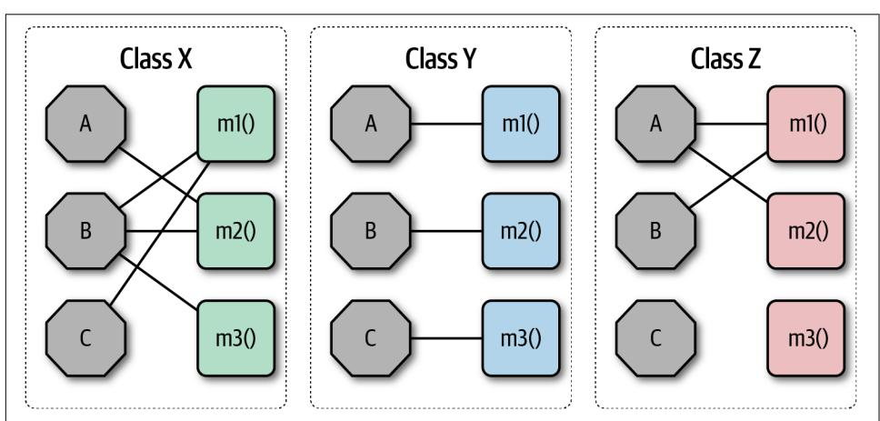
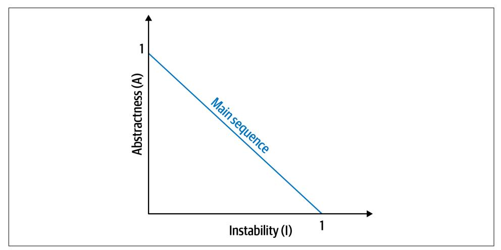
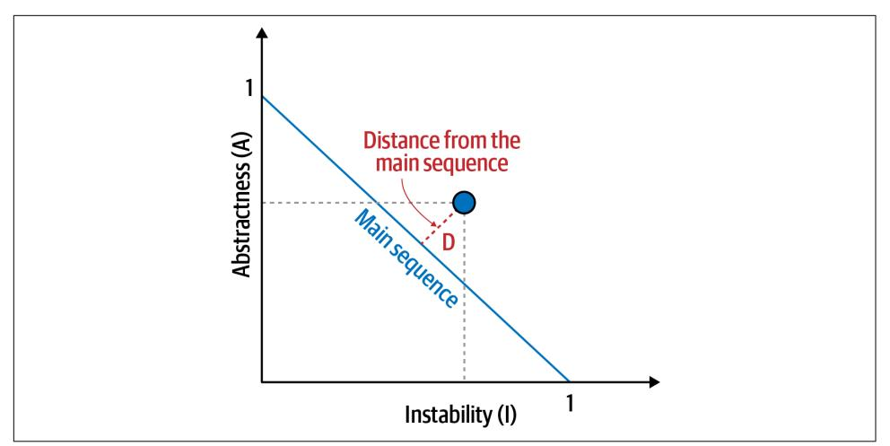
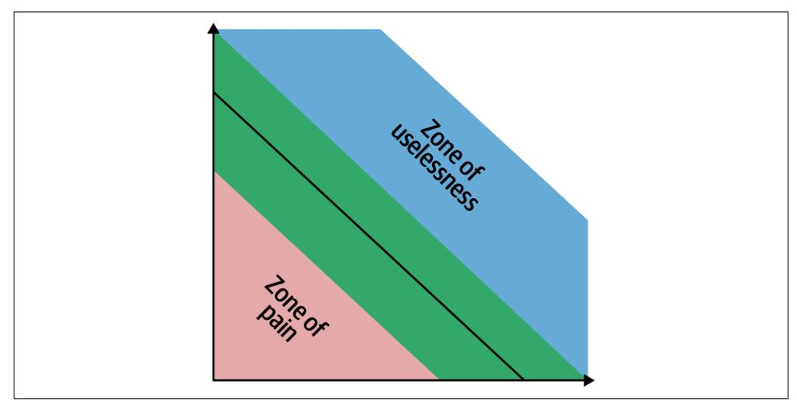
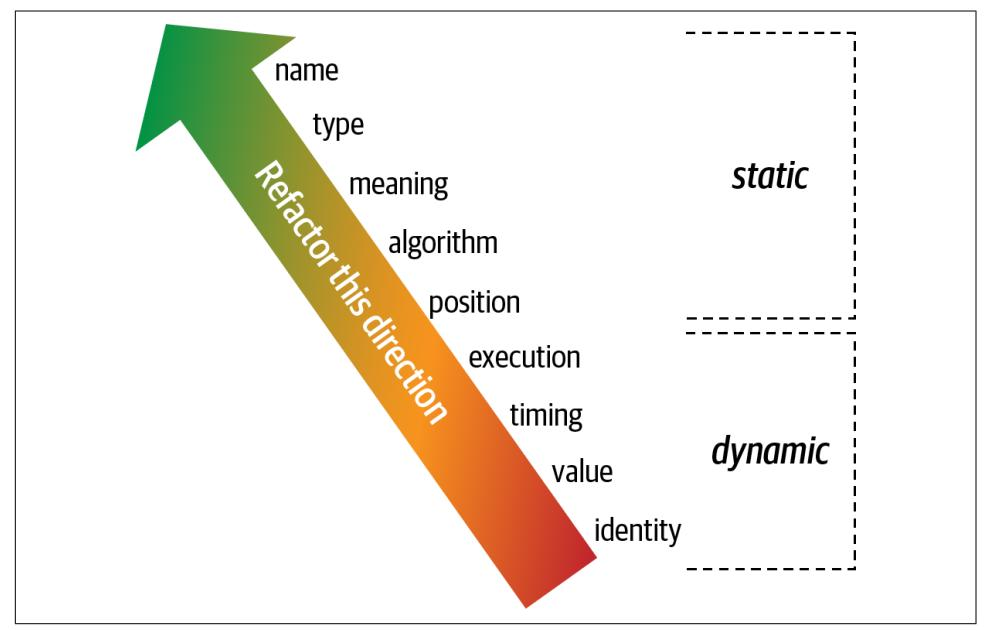
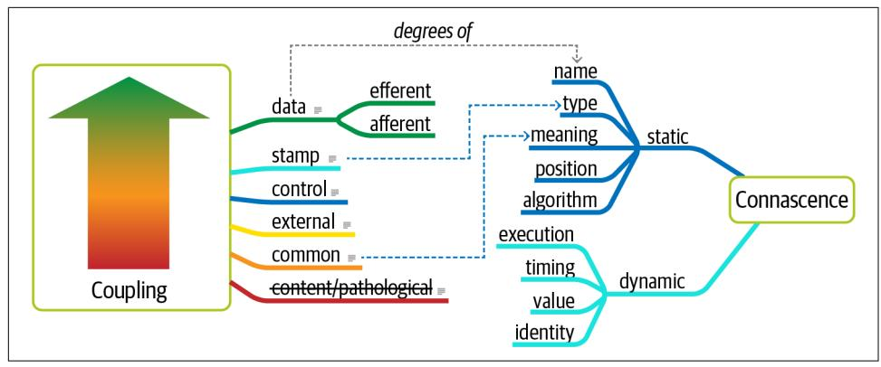

# Chapter 3. Modularity

First, we want to untangle some common terms used and overused in discussions about architecture surrounding modularity and provide definitions for use throughout the book.

95% of the words [about software architecture] are spent extolling the benefits of "modularity" and that little, if anything, is said about how to achieve it.

—[Glenford J. Myers (1978)](https://en.wikipedia.org/wiki/Glenford_Myers)

Different platforms offer different reuse mechanisms for code, but all support some way of grouping related code together into *modules*. While this concept is universal in software architecture, it has proven slippery to define. A casual internet search yields dozens of definitions, with no consistency (and some contradictions). As you can see from the quote from Myers, this isn't a new problem. However, because no recognized definition exists, we must jump into the fray and provide our own definitions for the sake of consistency throughout the book.

Understanding modularity and its many incarnations in the development platform of choice is critical for architects. Many of the tools we have to analyze architecture (such as metrics, fitness functions, and visualizations) rely on these modularity concepts. Modularity is an organizing principle. If an architect designs a system without paying attention to how the pieces wire together, they end up creating a system that presents myriad difficulties. To use a physics analogy, software systems model complex systems, which tend toward entropy (or disorder). Energy must be added to a physical system to preserve order. The same is true for software systems: architects must constantly expend energy to ensure good structural soundness, which won't happen by accident.

Preserving good modularity exemplifies our definition of an *implicit* architecture characteristic: virtually no project features a requirement that asks the architect to ensure good modular distinction and communication, yet sustainable code bases require order and consistency.
___

### **فصل ۳: ماژولاریتی (Modularity)**

در ابتدا، می‌خواهیم برخی از اصطلاحات رایج و پرکاربرد در بحث‌های معماری پیرامون ماژولاریتی را روشن کرده و تعاریفی برای استفاده در سراسر این کتاب ارائه دهیم.

> ۹۵٪ از واژگان [درباره معماری نرم‌افزار] صرف ستایش مزایای «ماژولاریتی» می‌شود و کمتر سخنی، یا شاید هیچ، درباره چگونگی دستیابی به آن به میان نمی‌آید.
>
> — گلنفورد جی. مایرز (۱۹۷۸)

پلتفرم‌های مختلف، مکانیسم‌های متفاوتی برای استفاده مجدد از کد ارائه می‌دهند، اما همه آن‌ها از روشی برای گروه‌بندی کدهای مرتبط در قالب *ماژول‌ها* (modules) پشتیبانی می‌کنند. اگرچه این مفهوم در معماری نرم‌افزار جهانی است، اما تعریف آن دشوار بوده است. یک جستجوی ساده در اینترنت ده‌ها تعریف را نشان می‌دهد که هیچ سازگاری (و گاهی تناقضاتی) با یکدیگر ندارند. همان‌طور که از نقل قول مایرز پیداست، این مشکل جدیدی نیست. با این حال، از آنجا که هیچ تعریف شناخته‌شده‌ای وجود ندارد، ما باید وارد این میدان شویم و برای حفظ انسجام در سراسر کتاب، تعاریف خود را ارائه دهیم.

درک ماژولاریتی و تجسم‌های گوناگون آن در پلتفرم توسعه انتخابی، برای معماران حیاتی است. بسیاری از ابزارهایی که برای تحلیل معماری در اختیار داریم (مانند معیارها، توابع شایستگی و مصورسازی‌ها) بر این مفاهیم ماژولاریتی تکیه دارند. ماژولاریتی یک اصل سازمان‌دهنده است. اگر یک معمار سیستمی را بدون توجه به نحوه اتصال قطعات به یکدیگر طراحی کند، در نهایت سیستمی خلق می‌کند که مشکلات بی‌شماری را به همراه خواهد داشت. با استفاده از یک تشبیه فیزیکی، سیستم‌های نرم‌افزاری سیستم‌های پیچیده‌ای را مدل‌سازی می‌کنند که به سمت بی‌نظمی یا انتروپی (entropy) گرایش دارند. برای حفظ نظم در یک سیستم فیزیکی باید به آن انرژی اضافه کرد. همین امر در مورد سیستم‌های نرم‌افزاری نیز صادق است: معماران باید دائماً برای اطمینان از سلامت ساختاری خوب انرژی صرف کنند، زیرا این امر به خودی خود اتفاق نخواهد افتاد.

حفظ ماژولاریتی خوب، نمونه‌ای از تعریف ما از یک ویژگی معماری *ضمنی* (implicit) است: تقریباً هیچ پروژه‌ای نیازمندی‌ای ندارد که از معمار بخواهد از تمایز و ارتباطات ماژولار خوب اطمینان حاصل کند، با این حال، پایگاه‌های کد پایدار نیازمند نظم و انسجام هستند.

---
## **Definition**

The dictionary defines *module* as "each of a set of standardized parts or independent units that can be used to construct a more complex structure." We use *modularity* to describe a logical grouping of related code, which could be a group of classes in an object-oriented language or functions in a structured or functional language. Most languages provide mechanisms for modularity (package in Java, namespace in .NET, and so on). Developers typically use modules as a way to group related code together. For example, the com.mycompany.customer package in Java should contain things related to customers.

Languages now feature a wide variety of packaging mechanisms, making a developer's chore of choosing between them difficult. For example, in many modern languages, developers can define behavior in functions/methods, classes, or packages/ namespaces, each with different visibility and scoping rules. Other languages complicate this further by adding programming constructs such as the [metaobject protocol](https://oreil.ly/9Zw-J) to provide developers even more extension mechanisms.

Architects must be aware of how developers package things because it has important implications in architecture. For example, if several packages are tightly coupled together, reusing one of them for related work becomes more difficult.

### **تعریف**

فرهنگ لغت *ماژول* (module) را این‌گونه تعریف می‌کند: «هر یک از مجموعه‌ای از قطعات استاندارد یا واحدهای مستقل که می‌توان از آن‌ها برای ساخت یک ساختار پیچیده‌تر استفاده کرد.» ما از *ماژولاریتی* (modularity) برای توصیف یک گروه‌بندی منطقی از کدهای مرتبط استفاده می‌کنیم، که می‌تواند گروهی از کلاس‌ها در یک زبان شیءگرا یا توابع در یک زبان ساختاریافته یا تابعی باشد. بیشتر زبان‌ها مکانیسم‌هایی برای ماژولاریتی فراهم می‌کنند (بسته یا package در جاوا، فضای نام یا namespace در دات‌نت، و غیره). توسعه‌دهندگان معمولاً از ماژول‌ها به عنوان راهی برای گروه‌بندی کدهای مرتبط با یکدیگر استفاده می‌کنند. به عنوان مثال، بسته `com.mycompany.customer` در جاوا باید شامل موارد مرتبط با مشتریان باشد.

زبان‌ها اکنون طیف گسترده‌ای از مکانیسم‌های بسته‌بندی را ارائه می‌دهند که انتخاب بین آن‌ها را برای توسعه‌دهندگان دشوار می‌سازد. به عنوان مثال، در بسیاری از زبان‌های مدرن، توسعه‌دهندگان می‌توانند رفتار را در توابع/متدها، کلاس‌ها، یا بسته‌ها/فضاهای نام تعریف کنند که هر کدام قوانین دید (visibility) و دامنه (scoping) متفاوتی دارند. زبان‌های دیگر با افزودن ساختارهای برنامه‌نویسی مانند [پروتکل متاآبجکت (metaobject protocol)](https://oreil.ly/9Zw-J)، این موضوع را پیچیده‌تر کرده و مکانیسم‌های توسعه بیشتری در اختیار توسعه‌دهندگان قرار می‌دهند.

معماران باید از نحوه بسته‌بندی کدها توسط توسعه‌دهندگان آگاه باشند، زیرا این امر پیامدهای مهمی در معماری دارد. به عنوان مثال، اگر چندین بسته به شدت به یکدیگر وابسته (coupled) باشند، استفاده مجدد از یکی از آن‌ها برای کارهای مرتبط دشوارتر می‌شود.

---
### **Modular Reuse Before Classes**

Developers who predate object-oriented languages may puzzle over why so many different separation schemes commonly exist. Much of the reason has to do with backward compatibility, not of code but rather for how developers think about things. In March of 1968, Edsger Dijkstra published a letter in the *Communications of the ACM* entitled "Go To Statement Considered Harmful." He denigrated the common use of the GOTO statement common in programming languages at the time that allowed nonlinear leaping around within code, making reasoning and debugging difficult.

This paper helped usher in the era of *structured* programming languages, exemplified by Pascal and C, which encouraged deeper thinking about how things fit together. Developers quickly realized that most of the languages had no good way to group like things together logically. Thus, the short era of *modular* languages was born, such as Modula (Pascal creator Niklaus Wirth's next language) and Ada. These languages had the programming construct of a *module*, much as we think about packages or name‐ spaces today (but without the classes).

The modular programming era was short-lived. Object-oriented languages became popular because they offered new ways to encapsulate and reuse code. Still, language designers realized the utility of modules, retaining them in the form of packages, namespaces, etc. Many odd compatibility features exist in languages to support these different paradigms. For example, Java supports modular (via packages and packagelevel initialization using static initializers), object-oriented, and functional paradigms, each programming style with its own scoping rules and quirks.

For discussions about architecture, we use modularity as a general term to denote a related grouping of code: classes, functions, or any other grouping. This doesn't imply a physical separation, merely a logical one; the difference is sometimes important. For example, lumping a large number of classes together in a monolithic application may make sense from a convenience standpoint. However, when it comes time to restructure the architecture, the coupling encouraged by loose partitioning becomes an impediment to breaking the monolith apart. Thus, it is useful to talk about modularity as a concept separate from the physical separation forced or implied by a particular platform.

It is worth noting the general concept of *namespace*, separate from the technical implementation in the .NET platform. Developers often need precise, fully qualified names for software assets to separate different software assets (components, classes, and so on) from each other. The most obvious example that people use every day is the internet: unique, global identifiers tied to IP addresses. Most languages have some modularity mechanism that doubles as a namespace to organize things: variables, functions, and/or methods. Sometimes the module structure is reflected physically. For example, Java requires that its package structure must reflect the directory structure of the physical class files.

---

#### **استفاده مجدد ماژولار پیش از کلاس‌ها**

توسعه‌دهندگانی که پیش از زبان‌های شیءگرا کار کرده‌اند، ممکن است از وجود این همه طرح‌های جداسازی مختلف متعجب شوند. بخش بزرگی از دلیل این امر به سازگاری رو به عقب (backward compatibility) مربوط می‌شود، نه سازگاری کد، بلکه سازگاری با نحوه تفکر توسعه‌دهندگان. در مارس ۱۹۶۸، ادسخر دایکسترا نامه‌ای در *نشریه ACM* با عنوان «دستور Go To مضر تلقی می‌شود» منتشر کرد. او استفاده رایج از دستور `GOTO` را که در آن زمان در زبان‌های برنامه‌نویسی متداول بود و امکان پرش غیرخطی در کد را فراهم می‌کرد و استدلال و اشکال‌زدایی را دشوار می‌ساخت، مورد انتقاد قرار داد.

این مقاله به آغاز دوران زبان‌های برنامه‌نویسی *ساختاریافته* (structured) مانند پاسکال و C کمک کرد، که تفکر عمیق‌تری را در مورد نحوه کنار هم قرار گرفتن اجزا تشویق می‌کرد. توسعه‌دهندگان به سرعت دریافتند که بیشتر زبان‌ها راه خوبی برای گروه‌بندی منطقی موارد مشابه با یکدیگر ندارند. بنابراین، دوران کوتاه زبان‌های *ماژولار* (modular) مانند مدولا (Modula) (زبان بعدی خالق پاسکال، نیکلاوس ویرت) و ایدا (Ada) آغاز شد. این زبان‌ها ساختار برنامه‌نویسی *ماژول* را داشتند، بسیار شبیه به آنچه ما امروزه به عنوان بسته یا فضای نام می‌شناسیم (اما بدون کلاس‌ها).

دوران برنامه‌نویسی ماژولار کوتاه بود. زبان‌های شیءگرا محبوب شدند زیرا راه‌های جدیدی برای کپسوله‌سازی و استفاده مجدد از کد ارائه می‌دادند. با این حال، طراحان زبان به سودمندی ماژول‌ها پی بردند و آن‌ها را در قالب بسته‌ها، فضاهای نام و غیره حفظ کردند. بسیاری از ویژگی‌های سازگاری عجیب در زبان‌ها برای پشتیبانی از این پارادایم‌های مختلف وجود دارد. به عنوان مثال، جاوا از پارادایم‌های ماژولار (از طریق بسته‌ها و مقداردهی اولیه در سطح بسته با استفاده از مقداردهی‌های استاتیک)، شیءگرا و تابعی پشتیبانی می‌کند که هر سبک برنامه‌نویسی، قوانین دامنه و ویژگی‌های خاص خود را دارد.

برای بحث‌های معماری، ما از ماژولاریتی به عنوان یک اصطلاح کلی برای نشان دادن یک گروه‌بندی مرتبط از کد استفاده می‌کنیم: کلاس‌ها، توابع یا هر گروه‌بندی دیگر. این به معنای جداسازی فیزیکی نیست، بلکه صرفاً یک جداسازی منطقی است؛ این تفاوت گاهی اوقات مهم است. به عنوان مثال، جمع کردن تعداد زیادی کلاس در یک برنامه یکپارچه (monolithic) ممکن است از نظر راحتی منطقی باشد. با این حال، هنگامی که زمان بازسازی معماری فرا می‌رسد، وابستگی‌ای که توسط این تقسیم‌بندی سست تشویق شده، به مانعی برای شکستن یکپارچگی تبدیل می‌شود. بنابراین، مفید است که در مورد ماژولاریتی به عنوان مفهومی جدا از جداسازی فیزیکی که توسط یک پلتفرم خاص تحمیل یا القا می‌شود، صحبت کنیم.

شایان ذکر است که مفهوم کلی *فضای نام* (namespace)، جدا از پیاده‌سازی فنی آن در پلتفرم دات‌نت، وجود دارد. توسعه‌دهندگان اغلب برای جدا کردن دارایی‌های نرم‌افزاری مختلف (مؤلفه‌ها، کلاس‌ها و غیره) از یکدیگر به نام‌های دقیق و کاملاً مشخص نیاز دارند. بارزترین مثالی که مردم هر روز از آن استفاده می‌کنند، اینترنت است: شناسه‌های منحصر به فرد و جهانی که به آدرس‌های IP متصل هستند. بیشتر زبان‌ها مکانیزم ماژولاریتی‌ای دارند که به عنوان فضای نام نیز برای سازماندهی موارد عمل می‌کند: متغیرها، توابع و/یا متدها. گاهی اوقات ساختار ماژول به صورت فیزیکی منعکس می‌شود. به عنوان مثال، جاوا ایجاب می‌کند که ساختار بسته آن باید ساختار دایرکتوری فایل‌های کلاس فیزیکی را منعکس کند.

---
#### **A Language with No Name Conicts: Java 1.0**

The original designers of Java had extensive experience dealing with name conflicts and clashes in the various programming platforms at the time. The original design of Java used a clever hack to avoid the possibility of ambiguity between two classes that had the same name. For example, what if your problem domain included a catalog *order* and an installation *order*: both named *order* but with very different connota‐ tions (and classes). The solution in Java was to create the package namespace mecha‐ nism, along with the requirement that the physical directory structure just match the package name. Because filesystems won't allow the same named file to reside in the same directory, they leveraged the inherent features of the operating system to avoid the possibility of ambiguity. Thus, the original classpath in Java contained only directories, disallowing the possibility of name conflicts.

However, as the language designers discovered, forcing every project to have a fully formed directory structure was cumbersome, especially as projects became larger. Plus, building reusable assets was difficult: frameworks and libraries must be "explo‐ ded" into the directory structure. In the second major release of Java (1.2, called Java 2), designers added the jar mechanism, allowing an archive file to act as a directory structure on a classpath. For the next decade, Java developers struggled with getting the classpath exactly right, as a combination of directories and JAR files. And, of course, the original intent was broken: now two JAR files could create conflicting names on a classpath, leading to numerous war stories of debugging class loaders.

---

##### **زبانی بدون تداخل نام: جاوا ۱.۰**

طراحان اولیه جاوا تجربه گسترده‌ای در برخورد با تداخل‌ها و برخوردهای نام در پلتفرم‌های مختلف برنامه‌نویسی آن زمان داشتند. طراحی اولیه جاوا از یک ترفند هوشمندانه برای جلوگیری از امکان ابهام بین دو کلاس با نام یکسان استفاده کرد. به عنوان مثال، اگر دامنه مسئله شما شامل یک *سفارش* (order) کاتالوگ و یک *دستور* (order) نصب باشد چه؟ هر دو *order* نامیده می‌شوند اما با مفاهیم (و کلاس‌های) بسیار متفاوت. راه‌حل در جاوا ایجاد مکانیزم فضای نام بسته، همراه با این الزام بود که ساختار دایرکتوری فیزیکی دقیقاً با نام بسته مطابقت داشته باشد. از آنجایی که سیستم‌های فایل اجازه نمی‌دهند فایلی با نام یکسان در یک دایرکتوری قرار گیرد، آن‌ها از ویژگی‌های ذاتی سیستم عامل برای جلوگیری از امکان ابهام بهره بردند. بنابراین، مسیر کلاس (classpath) اولیه در جاوا فقط شامل دایرکتوری‌ها بود و امکان تداخل نام را از بین می‌برد.

با این حال، همانطور که طراحان زبان دریافتند، مجبور کردن هر پروژه به داشتن یک ساختار دایرکتوری کاملاً شکل‌گرفته، به‌ویژه با بزرگ‌تر شدن پروژه‌ها، دست‌وپاگیر بود. به علاوه، ساخت دارایی‌های قابل استفاده مجدد دشوار بود: چارچوب‌ها و کتابخانه‌ها باید در ساختار دایرکتوری «باز» (exploded) می‌شدند. در دومین نسخه اصلی جاوا (۱.۲، که جاوا ۲ نامیده شد)، طراحان مکانیزم `jar` را اضافه کردند که به یک فایل آرشیو اجازه می‌داد تا به عنوان یک ساختار دایرکتوری در مسیر کلاس عمل کند. برای دهه بعد، توسعه‌دهندگان جاوا با تنظیم دقیق مسیر کلاس به عنوان ترکیبی از دایرکتوری‌ها و فایل‌های JAR دست‌وپنجه نرم می‌کردند. و البته، هدف اولیه نقض شد: اکنون دو فایل JAR می‌توانستند نام‌های متناقضی را در یک مسیر کلاس ایجاد کنند که منجر به داستان‌های بی‌شماری از اشکال‌زدایی بارگذارنده‌های کلاس (class loaders) شد.

---

## **Measuring Modularity**

Given the importance of modularity to architects, they need tools to understand it. Fortunately, researchers created a variety of language-agnostic metrics to help archi‐ tects understand modularity. We focus on three key concepts: *cohesion*, *coupling*, and *connascence*.

---

### **اندازه‌گیری ماژولاریتی**

با توجه به اهمیت ماژولاریتی برای معماران، آن‌ها به ابزارهایی برای درک آن نیاز دارند. خوشبختانه، محققان انواع معیارهای مستقل از زبان را برای کمک به معماران در درک ماژولاریتی ایجاد کرده‌اند. ما بر روی سه مفهوم کلیدی تمرکز می‌کنیم: *انسجام* (cohesion)، *وابستگی* (coupling) و *هم‌زادی* (connascence).

---

### **Cohesion**

*Cohesion* refers to what extent the parts of a module should be contained within the same module. In other words, it is a measure of how related the parts are to one another. Ideally, a cohesive module is one where all the parts should be packaged together, because breaking them into smaller pieces would require coupling the parts together via calls between modules to achieve useful results.

Attempting to divide a cohesive module would only result in increased coupling and decreased readability.

—Larry Constantine

Computer scientists have defined a range of cohesion measures, listed here from best to worst:

*Functional cohesion*

Every part of the module is related to the other, and the module contains every‐ thing essential to function.

*Sequential cohesion*

Two modules interact, where one outputs data that becomes the input for the other.

*Communicational cohesion*

Two modules form a communication chain, where each operates on information and/or contributes to some output. For example, add a record to the database and generate an email based on that information.

#### *Procedural cohesion*

Two modules must execute code in a particular order.

#### *Temporal cohesion*

Modules are related based on timing dependencies. For example, many systems have a list of seemingly unrelated things that must be initialized at system startup; these different tasks are temporally cohesive.

#### *Logical cohesion*

The data within modules is related logically but not functionally. For example, consider a module that converts information from text, serialized objects, or streams. Operations are related, but the functions are quite different. A common example of this type of cohesion exists in virtually every Java project in the form of the StringUtils package: a group of static methods that operate on String but are otherwise unrelated.

#### *Coincidental cohesion*

Elements in a module are not related other than being in the same source file; this represents the most negative form of cohesion.

Despite having seven variants listed, *cohesion* is a less precise metric than *coupling*. Often, the degree of cohesiveness of a particular module is at the discretion of a par‐ ticular architect. For example, consider this module definition:

Customer Maintenance

- add customer
- update customer
- get customer
- notify customer
- get customer orders
- cancel customer orders

Should the last two entries reside in this module or should the developer create two separate modules, such as:

Customer Maintenance

- add customer
- update customer
- get customer
- notify customer

Order Maintenance

- get customer orders
- cancel customer orders

Which is the correct structure? As always, it depends:

- Are those the only two operations for Order Maintenance? If so, it may make sense to collapse those operations back into Customer Maintenance.
- Is Customer Maintenance expected to grow much larger, encouraging developers to look for opportunities to extract behavior?
- Does Order Maintenance require so much knowledge of Customer information that separating the two modules would require a high degree of coupling to make it functional? This relates back to the Larry Constantine quote.

These questions represent the kind of trade-off analysis at the heart of the job of a software architect.

Surprisingly, given the subjectiveness of cohesion, computer scientists have developed a good structural metric to determine cohesion (or, more specifically, the lack of cohesion). A well-known set of metrics named the [Chidamber and Kemerer Object](https://oreil.ly/-1lMh)[oriented metrics suite](https://oreil.ly/-1lMh) was developed by the eponymous authors to measure particu‐ lar aspects of object-oriented software systems. The suite includes many common code metrics, such as cyclomatic complexity (see ["Cyclomatic Complexity" on page](#page-98-0) [79](#page-98-0)) and several important coupling metrics discussed in ["Coupling" on page 44.](#page-63-0)

The Chidamber and Kemerer Lack of Cohesion in Methods (LCOM) metric meas‐ ures the structural cohesion of a module, typically a component. The initial version appears in Equation 3-1.

*Equation 3-1. LCOM, version 1 LCOM* = *P* − *Q* , if *P* > *Q* 0, otherwise

*P* increases by one for any method that doesn't access a particular shared field and *Q* decreases by one for methods that do share a particular shared field. The authors sympathize with those who don't understand this formulation. Worse, it has gradually gotten more elaborate over time. The second variation introduced in 1996 (thus the name *LCOM96B*) appears in [Equation 3-2.](#page-62-0)

*Equation 3-2. LCOM 96b*

$$LCOM96b = \frac{1}{a} \sum_{j=1}^{a} \frac{m - \mu(Aj)}{m}$$

We wont bother untangling the variables and operators in Equation 3-2 because the following written explanation is clearer. Basically, the LCOM metric exposes incidental coupling within classes. Here's a better definition of LCOM:

#### $LCOM$

The sum of sets of methods not shared via sharing fields

Consider a class with private fields a and b. Many of the methods only access a, and many other methods only access b. The *sum* of the sets of methods not shared via sharing fields (a and b) is high; therefore, this class reports a high LCOM score, indicating that it scores high in lack of cohesion in methods. Consider the three classes shown in Figure 3-1.



Figure 3-1. Illustration of the LCOM metric, where fields are octagons and methods are squares

In Figure 3-1, fields appear as single letters and methods appear as blocks. In Class X, the LCOM score is low, indicating good structural cohesion. Class Y, however, lacks cohesion; each of the field/method pairs in Class Y could appear in its own class without affecting behavior. Class Z shows mixed cohesion, where developers could refactor the last field/method combination into its own class.

The LCOM metric is useful to architects who are analyzing code bases in order to move from one architectural style to another. One of the common headaches when moving architectures are shared utility classes. Using the LCOM metric can help architects find classes that are incidentally coupled and should never have been a single class to begin with.

Many software metrics have serious deficiencies, and LCOM is not immune. All this metric can find is *structural* lack of cohesion; it has no way to determine logically if particular pieces fit together. This reflects back on our Second Law of Software Archi‐ tecture: prefer *why* over *how*.

---

#### **انسجام (Cohesion)**

*انسجام* به این اشاره دارد که تا چه حد اجزای یک ماژول باید در همان ماژول قرار گیرند. به عبارت دیگر، این معیاری است برای سنجش میزان ارتباط اجزا با یکدیگر. در حالت ایده‌آل، یک ماژول منسجم، ماژولی است که تمام اجزای آن باید با هم بسته‌بندی شوند، زیرا شکستن آن‌ها به قطعات کوچک‌تر برای دستیابی به نتایج مفید، نیازمند وابسته‌سازی اجزا از طریق فراخوانی بین ماژول‌ها خواهد بود.

> تلاش برای تقسیم یک ماژول منسجم تنها منجر به افزایش وابستگی و کاهش خوانایی می‌شود.
>
> — لری کنستانتین

دانشمندان کامپیوتر طیفی از معیارهای انسجام را تعریف کرده‌اند که در اینجا از بهترین تا بدترین فهرست شده‌اند:

*   **انسجام عملکردی (Functional cohesion)**
    هر بخش از ماژول با بخش دیگر مرتبط است و ماژول شامل هر چیزی است که برای عملکرد ضروری است.

*   **انسجام ترتیبی (Sequential cohesion)**
    دو ماژول با هم تعامل دارند، به طوری که خروجی یکی، ورودی دیگری می‌شود.

*   **انسجام ارتباطی (Communicational cohesion)**
    دو ماژول یک زنجیره ارتباطی تشکیل می‌دهند که در آن هر یک بر روی اطلاعاتی عمل می‌کند و/یا به خروجی‌ای کمک می‌کند. به عنوان مثال، افزودن یک رکورد به پایگاه داده و تولید یک ایمیل بر اساس آن اطلاعات.

*   **انسجام رویه‌ای (Procedural cohesion)**
    دو ماژول باید کد را به ترتیب خاصی اجرا کنند.

*   **انسجام زمانی (Temporal cohesion)**
    ماژول‌ها بر اساس وابستگی‌های زمانی با هم مرتبط هستند. به عنوان مثال، بسیاری از سیستم‌ها فهرستی از کارهای ظاهراً نامرتبط دارند که باید در هنگام راه‌اندازی سیستم مقداردهی اولیه شوند؛ این وظایف مختلف از نظر زمانی منسجم هستند.

*   **انسجام منطقی (Logical cohesion)**
    داده‌های درون ماژول‌ها به صورت منطقی با هم مرتبط هستند اما از نظر عملکردی نه. به عنوان مثال، ماژولی را در نظر بگیرید که اطلاعات را از متن، اشیاء سریال‌شده یا جریان‌ها تبدیل می‌کند. عملیات مرتبط هستند، اما توابع کاملاً متفاوت‌اند. یک نمونه رایج از این نوع انسجام تقریباً در هر پروژه جاوا در قالب بسته `StringUtils` وجود دارد: گروهی از متدهای استاتیک که بر روی رشته (String) عمل می‌کنند اما در غیر این صورت با هم بی‌ارتباط هستند.

*   **انسجام تصادفی (Coincidental cohesion)**
    عناصر در یک ماژول به جز قرار گرفتن در یک فایل منبع یکسان، با هم ارتباطی ندارند؛ این نشان‌دهنده منفی‌ترین شکل انسجام است.

با وجود داشتن هفت نوع فهرست‌شده، *انسجام* معیار دقیق‌تری نسبت به *وابستگی* نیست. اغلب، درجه انسجام یک ماژول خاص به تشخیص یک معمار خاص بستگی دارد. به عنوان مثال، این تعریف ماژول را در نظر بگیرید:

```
نگهداری مشتری (Customer Maintenance)
- افزودن مشتری
- به‌روزرسانی مشتری
- دریافت مشتری
- اطلاع‌رسانی به مشتری
- دریافت سفارشات مشتری
- لغو سفارشات مشتری
```

آیا دو ورودی آخر باید در این ماژول قرار گیرند یا توسعه‌دهنده باید دو ماژول جداگانه ایجاد کند، مانند:

```
نگهداری مشتری (Customer Maintenance)
- افزودن مشتری
- به‌روزرسانی مشتری
- دریافت مشتری
- اطلاع‌رسانی به مشتری

نگهداری سفارش (Order Maintenance)
- دریافت سفارشات مشتری
- لغو سفارشات مشتری
```

کدام ساختار صحیح است؟ مثل همیشه، بستگی دارد:

*   آیا این‌ها تنها دو عملیات برای «نگهداری سفارش» هستند؟ اگر چنین است، ممکن است منطقی باشد که آن عملیات را به «نگهداری مشتری» بازگردانیم.
*   آیا انتظار می‌رود «نگهداری مشتری» بسیار بزرگ‌تر شود و توسعه‌دهندگان را تشویق به جستجوی فرصت‌هایی برای استخراج رفتار کند؟
*   آیا «نگهداری سفارش» به قدری به اطلاعات مشتری نیاز دارد که جدا کردن دو ماژول نیازمند درجه بالایی از وابستگی برای کارکرد آن باشد؟ این به نقل قول لری کنستانتین بازمی‌گردد.

این سؤالات، نوعی تحلیل بده‌بستان را نشان می‌دهند که در قلب کار یک معمار نرم‌افزار قرار دارد.

با کمال تعجب، با توجه به ذهنی بودن انسجام، دانشمندان کامپیوتر یک معیار ساختاری خوب برای تعیین انسجام (یا به طور خاص، عدم انسجام) توسعه داده‌اند. مجموعه‌ای از معیارهای شناخته‌شده به نام [مجموعه معیارهای شیءگرای چیدامبر و کمرر (Chidamber and Kemerer Object-oriented metrics suite)](https://oreil.ly/-1lMh) توسط نویسندگان هم‌نام آن برای اندازه‌گیری جنبه‌های خاص سیستم‌های نرم‌افزاری شیءگرا توسعه داده شد. این مجموعه شامل بسیاری از معیارهای رایج کد، مانند پیچیدگی سایکلوماتیک (cyclomatic complexity) (به «پیچیدگی سایکلوماتیک» در صفحه ۷۹ مراجعه کنید) و چندین معیار مهم وابستگی است که در «وابستگی» در صفحه ۴۴ مورد بحث قرار گرفته‌اند.

معیار عدم انسجام در متدها (Lack of Cohesion in Methods یا LCOM) از مجموعه چیدامبر و کمرر، انسجام ساختاری یک ماژول، معمولاً یک مؤلفه، را اندازه‌گیری می‌کند. نسخه اولیه در معادله ۳-۱ ظاهر می‌شود.

*معادله ۳-۱. LCOM، نسخه ۱*
`LCOM = P - Q`، اگر `P > Q`
در غیر این صورت ۰

ا *P* به ازای هر متدی که به یک فیلد مشترک خاص دسترسی ندارد، یک واحد افزایش می‌یابد و *Q* به ازای متدهایی که یک فیلد مشترک خاص را به اشتراک می‌گذارند، یک واحد کاهش می‌یابد. نویسندگان با کسانی که این فرمول را درک نمی‌کنند، همدردی می‌کنند. بدتر از آن، این فرمول به تدریج با گذشت زمان پیچیده‌تر شده است. نسخه دوم که در سال ۱۹۹۶ معرفی شد (و به همین دلیل *LCOM96B* نامیده می‌شود) در معادله ۳-۲ ظاهر می‌شود.

*معادله ۳-۲. LCOM 96b*
$$LCOM96b = \frac{1}{a} \sum_{j=1}^{a} \frac{m - \mu(Aj)}{m}$$
ما خود را درگیر باز کردن متغیرها و عملگرهای معادله ۳-۲ نمی‌کنیم زیرا توضیح نوشتاری زیر واضح‌تر است. اساساً، معیار LCOM وابستگی تصادفی درون کلاس‌ها را آشکار می‌کند. در اینجا تعریف بهتری از LCOM ارائه شده است:

> مجموع مجموعه‌هایی از متدها که از طریق اشتراک فیلدها به اشتراک گذاشته نشده‌اند.

کلاسی را با فیلدهای خصوصی `a` و `b` در نظر بگیرید. بسیاری از متدها فقط به `a` دسترسی دارند و بسیاری از متدهای دیگر فقط به `b`. *مجموع* مجموعه‌های متدهایی که از طریق اشتراک فیلدها (`a` و `b`) به اشتراک گذاشته نشده‌اند، بالا است؛ بنابراین، این کلاس امتیاز LCOM بالایی را گزارش می‌دهد که نشان‌دهنده امتیاز بالای آن در عدم انسجام در متدها است. سه کلاس نشان داده شده در شکل ۳-۱ را در نظر بگیرید.


*شکل ۳-۱. تصویری از معیار LCOM، که در آن فیلدها هشت‌ضلعی و متدها مربع هستند*

در شکل ۳-۱، فیلدها به صورت حروف منفرد و متدها به صورت بلوک ظاهر می‌شوند. در کلاس X، امتیاز LCOM پایین است که نشان‌دهنده انسجام ساختاری خوب است. کلاس Y، با این حال، فاقد انسجام است؛ هر یک از جفت‌های فیلد/متد در کلاس Y می‌تواند بدون تأثیر بر رفتار، در کلاس خود قرار گیرد. کلاس Z انسجام مختلطی را نشان می‌دهد، که در آن توسعه‌دهندگان می‌توانند آخرین ترکیب فیلد/متد را به کلاس خود بازآفرینی (refactor) کنند.

معیار LCOM برای معمارانی که در حال تحلیل پایگاه‌های کد به منظور انتقال از یک سبک معماری به سبک دیگر هستند، مفید است. یکی از دردسرهای رایج هنگام تغییر معماری، کلاس‌های ابزار مشترک (shared utility classes) است. استفاده از معیار LCOM می‌تواند به معماران کمک کند تا کلاس‌هایی را پیدا کنند که به طور تصادفی به هم وابسته‌اند و از ابتدا هرگز نباید یک کلاس واحد می‌بودند.

بسیاری از معیارهای نرم‌افزاری کمبودهای جدی دارند و LCOM نیز از این قاعده مستثنی نیست. تمام کاری که این معیار می‌تواند انجام دهد، یافتن عدم انسجام *ساختاری* است؛ این معیار راهی برای تعیین منطقی اینکه آیا قطعات خاصی با هم تناسب دارند یا نه، ندارد. این به قانون دوم معماری نرم‌افزار ما بازمی‌گردد: *چرا* را بر *چگونه* ترجیح دهید.
___

### **Coupling**

Fortunately, we have better tools to analyze coupling in code bases, based in part on graph theory: because the method calls and returns form a call graph, analysis based on mathematics becomes possible. In 1979, Edward Yourdon and Larry Constantine published *Structured Design: Fundamentals of a Discipline of Computer Program and Systems Design* (Prentice-Hall), defining many core concepts, including the metrics *afferent* and *efferent* coupling. *Afferent* coupling measures the number of *incoming* connections to a code artifact (component, class, function, and so on). *Efferent* cou‐ pling measures the *outgoing* connections to other code artifacts. For virtually every platform tools exist that allow architects to analyze the coupling characteristics of code in order to assist in restructuring, migrating, or understanding a code base.

### **Why Such Similar Names for Coupling Metrics?**

Why are two critical metrics in the architecture world that represent opposite con‐ cepts named virtually the same thing, differing in only the vowels that sound the most alike? These terms originate from Yourdon and Constantine's *Structured Design*. Bor‐ rowing concepts from mathematics, they coined the now-common afferent and effer‐ ent coupling terms, which should have been called incoming and outgoing coupling. However, because the original authors leaned toward mathematical symmetry rather than clarity, developers came up with several mnemonics to help out: *a* appears before *e* in the English alphabet, corresponding to *incoming* being before *outgoing*, or the observation that the letter *e* in efferent matches the initial letter in *exit*, corre‐ sponding to outgoing connections.

---

#### **وابستگی (Coupling)**

خوشبختانه، ما ابزارهای بهتری برای تحلیل وابستگی در پایگاه‌های کد داریم که تا حدی بر اساس نظریه گراف است: از آنجایی که فراخوانی‌ها و بازگشت‌های متدها یک گراف فراخوانی (call graph) را تشکیل می‌دهند، تحلیل مبتنی بر ریاضیات ممکن می‌شود. در سال ۱۹۷۹، ادوارد یوردون و لری کنستانتین کتاب *طراحی ساختاریافته: مبانی یک رشته از برنامه کامپیوتری و طراحی سیستم‌ها* (انتشارات Prentice-Hall) را منتشر کردند که در آن بسیاری از مفاهیم اصلی، از جمله معیارهای وابستگی *آوران* (afferent) و *وابران* (efferent) تعریف شد. وابستگی *آوران* تعداد اتصالات *ورودی* به یک مصنوع کد (مؤلفه، کلاس، تابع و غیره) را اندازه‌گیری می‌کند. وابستگی *وابران* اتصالات *خروجی* به سایر مصنوعات کد را اندازه‌گیری می‌کند. تقریباً برای هر پلتفرمی ابزارهایی وجود دارد که به معماران اجازه می‌دهد ویژگی‌های وابستگی کد را به منظور کمک به بازسازی، انتقال یا درک یک پایگاه کد، تحلیل کنند.

##### **چرا نام‌های معیارهای وابستگی اینقدر شبیه به هم هستند؟**

چرا دو معیار حیاتی در دنیای معماری که مفاهیم متضادی را نشان می‌دهند، تقریباً یک نام دارند و فقط در حروفی که بیشترین شباهت صدایی را دارند، متفاوتند؟ این اصطلاحات از کتاب *طراحی ساختاریافته* یوردون و کنستانتین سرچشمه می‌گیرند. آن‌ها با وام گرفتن مفاهیم از ریاضیات، اصطلاحات وابستگی آوران و وابران را که اکنون رایج است، ابداع کردند که باید وابستگی ورودی و خروجی نامیده می‌شد. با این حال، از آنجایی که نویسندگان اصلی به جای وضوح، به تقارن ریاضی تمایل داشتند، توسعه‌دهندگان چندین یادآور (mnemonics) برای کمک ابداع کردند: `a` قبل از `e` در الفبای انگلیسی می‌آید که متناظر با *ورودی* (incoming) قبل از *خروجی* (outgoing) است، یا این مشاهده که حرف `e` در `efferent` با حرف اول `exit` مطابقت دارد که متناظر با اتصالات خروجی است.

### **Abstractness, Instability, and Distance from the Main Sequence**

While the raw value of component coupling has value to architects, several other derived metrics allow a deeper evaluation. These metrics were created by Robert Mar‐ tin for a C++ book, but are widely applicable to other object-oriented languages.

*Abstractness* is the ratio of abstract artifacts (abstract classes, interfaces, and so on) to concrete artifacts (implementation). It represents a measure of abstractness versus implementation. For example, consider a code base with no abstractions, just a huge, single function of code (as in a single main() method). The flip side is a code base with too many abstractions, making it difficult for developers to understand how things wire together (for example, it takes developers a while to figure out what to do with an AbstractSingletonProxyFactoryBean).

The formula for abstractness appears in Equation 3-3.

*Equation 3-3. Abstractness*

$$A = \frac{\sum m^a}{\sum m^c}$$

In the equation,  $m^a$  represents *abstract* elements (interfaces or abstract classes) with the module, and  $m^c$  represents *concrete* elements (nonabstract classes). This metric looks for the same criteria. The easiest way to visualize this metric: consider an application with 5,000 lines of code, all in one main() method. The abstractness numerator is 1, while the denominator is 5,000, yielding an abstractness of almost 0. Thus, this metric measures the ratio of abstractions in your code.

Architects calculate abstractness by calculating the ratio of the sum of abstract artifacts to the sum of the concrete ones.

Another derived metric, *instability*, is defined as the ratio of efferent coupling to the sum of both efferent and afferent coupling, shown in Equation 3-4.

*Equation 3-4. Instability*

$$I = \frac{C^e}{C^e + C^a}$$

In the equation,  $c^e$  represents efferent (or outgoing) coupling, and  $c^a$  represents afferent (or incoming) coupling.

The *instability* metric determines the volatility of a code base. A code base that exhibits high degrees of instability breaks more easily when changed because of high coupling. For example, if a class calls to many other classes to delegate work, the calling class shows high susceptibility to breakage if one or more of the called methods change.

### **Distance from the Main Sequence**

One of the few holistic metrics architects have for architectural structure is *distance from the main sequence*, a derived metric based on *instability* and *abstractness*, shown in Equation 3-5.

*Equation 3-5. Distance from the main sequence D* = *A* + *I* − 1

In the equation, A = *abstractness* and I = *instability*.

Note that both *abstractness* and *instability* are fractions whose results will always fall between 0 and 1 (except in extreme cases of abstractness that wouldn't be practical). Thus, when graphing the relationship, we see the graph in Figure 3-2.



*Figure 3-2. The main sequence denes the ideal relationship between abstractness and instability*

The *distance* metric imagines an ideal relationship between abstractness and instabil‐ ity; classes that fall near this idealized line exhibit a healthy mixture of these two com‐ peting concerns. For example, graphing a particular class allows developers to calculate the *distance from the main sequence* metric, illustrated in [Figure 3-3.](#page-66-0)



*Figure 3-3. Normalized distance from the main sequence for a particular class*

In Figure 3-3, developers graph the candidate class, then measure the distance from the idealized line. The closer to the line, the better balanced the class. Classes that fall too far into the upper-righthand corner enter into what architects call the *zone of use‐ lessness*: code that is too abstract becomes difficult to use. Conversely, code that falls into the lower-lefthand corner enter the *zone of pain*: code with too much implemen‐ tation and not enough abstraction becomes brittle and hard to maintain, illustrated in Figure 3-4.



*Figure 3-4. Zones of Uselessness and Pain*

Tools exist in many platforms to provide these measures, which assist architects when analyzing code bases because of unfamiliarity, migration, or technical debt assessment.

---

#### **انتزاع، ناپایداری و فاصله از دنباله اصلی**

در حالی که مقدار خام وابستگی مؤلفه برای معماران ارزشمند است، چندین معیار مشتق‌شده دیگر امکان ارزیابی عمیق‌تری را فراهم می‌کنند. این معیارها توسط رابرت مارتین برای کتابی در مورد C++ ایجاد شدند، اما به طور گسترده برای سایر زبان‌های شیءگرا نیز قابل استفاده هستند.

*انتزاع* (Abstractness) نسبت مصنوعات انتزاعی (کلاس‌های انتزاعی، رابط‌ها و غیره) به مصنوعات انضمامی (پیاده‌سازی) است. این معیار، انتزاع در برابر پیاده‌سازی را اندازه‌گیری می‌کند. به عنوان مثال، یک پایگاه کد بدون هیچ انتزاعی را در نظر بگیرید، فقط یک تابع کد بزرگ و منفرد (مانند یک متد `main()` واحد). نقطه مقابل، یک پایگاه کد با انتزاعات بیش از حد است که درک نحوه اتصال اجزا به یکدیگر را برای توسعه‌دهندگان دشوار می‌کند (به عنوان مثال، مدتی طول می‌کشد تا توسعه‌دهندگان بفهمند با یک `AbstractSingletonProxyFactoryBean` چه کار کنند).

فرمول انتزاع در معادله ۳-۳ ظاهر می‌شود.

*معادله ۳-۳. انتزاع*
$$A = \frac{\sum m^a}{\sum m^c}$$

در این معادله، `Na` نشان‌دهنده عناصر *انتزاعی* (رابط‌ها یا کلاس‌های انتزاعی) در ماژول است و `Nc` نشان‌دهنده عناصر *انضمامی* (کلاس‌های غیرانتزاعی) است. این معیار به دنبال معیارهای مشابهی است. ساده‌ترین راه برای تجسم این معیار: برنامه‌ای با ۵۰۰۰ خط کد را در نظر بگیرید که همگی در یک متد `main()` قرار دارند. صورت کسر انتزاع ۱ است، در حالی که مخرج ۵۰۰۰ است که انتزاعی نزدیک به ۰ را به دست می‌دهد. بنابراین، این معیار نسبت انتزاعات در کد شما را اندازه‌گیری می‌کند.

معماران انتزاع را با محاسبه نسبت مجموع مصنوعات انتزاعی به مجموع مصنوعات انضمامی محاسبه می‌کنند.

یک معیار مشتق‌شده دیگر، *ناپایداری* (instability)، به عنوان نسبت وابستگی وابران به مجموع هر دو وابستگی وابران و آوران تعریف می‌شود که در معادله ۳-۴ نشان داده شده است.

*معادله ۳-۴. ناپایداری*
$$I = \frac{C^e}{C^e + C^a}$$

در این معادله، `Ce` نشان‌دهنده وابستگی وابران (یا خروجی) و `Ca` نشان‌دهنده وابستگی آوران (یا ورودی) است.

معیار *ناپایداری* نوسان‌پذیری یک پایگاه کد را تعیین می‌کند. یک پایگاه کد که درجات بالایی از ناپایداری را نشان می‌دهد، به دلیل وابستگی بالا، هنگام تغییر راحت‌تر دچار شکست می‌شود. به عنوان مثال، اگر یک کلاس برای واگذاری کار به بسیاری از کلاس‌های دیگر فراخوانی کند، کلاس فراخوان‌کننده در صورت تغییر یک یا چند متد فراخوانده‌شده، حساسیت بالایی به شکست نشان می‌دهد.

##### **فاصله از دنباله اصلی (Distance from the Main Sequence)**

یکی از معدود معیارهای جامعی که معماران برای ساختار معماری در اختیار دارند، *فاصله از دنباله اصلی* است، یک معیار مشتق‌شده بر اساس *ناپایداری* و *انتزاع* که در معادله ۳-۵ نشان داده شده است.

*معادله ۳-۵. فاصله از دنباله اصلی*
`D = A + I - 1`

در این معادله، A = *انتزاع* و I = *ناپایداری* است.

توجه داشته باشید که هم *انتزاع* و هم *ناپایداری* کسرهایی هستند که نتایج آن‌ها همیشه بین ۰ و ۱ خواهد بود (به جز در موارد شدید انتزاع که عملی نخواهد بود). بنابراین، هنگام ترسیم رابطه، نمودار شکل ۳-۲ را می‌بینیم.


*شکل ۳-۲. دنباله اصلی رابطه ایده‌آل بین انتزاع و ناپایداری را تعریف می‌کند*

معیار *فاصله* یک رابطه ایده‌آل بین انتزاع و ناپایداری را تصور می‌کند؛ کلاس‌هایی که نزدیک به این خط ایده‌آل قرار می‌گیرند، ترکیبی سالم از این دو دغدغه رقیب را نشان می‌دهند. به عنوان مثال، ترسیم یک کلاس خاص به توسعه‌دهندگان اجازه می‌دهد تا معیار *فاصله از دنباله اصلی* را محاسبه کنند که در [شکل ۳-۳](app://obsidian.md/index.html#page-66-0) نشان داده شده است.


*شکل ۳-۳. فاصله نرمال‌شده از دنباله اصلی برای یک کلاس خاص*

در شکل ۳-۳، توسعه‌دهندگان کلاس مورد نظر را ترسیم می‌کنند، سپس فاصله از خط ایده‌آل را اندازه‌گیری می‌کنند. هرچه به خط نزدیک‌تر باشد، کلاس متعادل‌تر است. کلاس‌هایی که بیش از حد به گوشه بالا سمت راست می‌افتند، وارد چیزی می‌شوند که معماران آن را *منطقه بی‌فایدگی* (zone of uselessness) می‌نامند: کدی که بیش از حد انتزاعی است، استفاده از آن دشوار می‌شود. برعکس، کدی که به گوشه پایین سمت چپ می‌افتد، وارد *منطقه درد* (zone of pain) می‌شود: کدی که پیاده‌سازی بیش از حد و انتزاع ناکافی دارد، شکننده و نگهداری آن دشوار می‌شود، که در شکل ۳-۴ نشان داده شده است.


*شکل ۳-۴. مناطق بی‌فایدگی و درد*

ابزارهایی در بسیاری از پلتفرم‌ها برای ارائه این معیارها وجود دارد که به معماران هنگام تحلیل پایگاه‌های کد به دلیل ناآشنایی، انتقال یا ارزیابی بدهی فنی کمک می‌کند.

##### **محدودیت‌های معیارها**

در حالی که صنعت چند معیار در سطح کد دارد که بینش ارزشمندی در مورد پایگاه‌های کد ارائه می‌دهد، ابزارهای ما در مقایسه با ابزارهای تحلیلی سایر رشته‌های مهندسی بسیار ابتدایی هستند. حتی معیارهایی که مستقیماً از ساختار کد مشتق شده‌اند، نیاز به تفسیر دارند. به عنوان مثال، پیچیدگی سایکلوماتیک (به «پیچیدگی سایکلوماتیک» در صفحه ۷۹ مراجعه کنید) پیچیدگی را در پایگاه‌های کد اندازه‌گیری می‌کند اما نمی‌تواند بین پیچیدگی *ذاتی* (essential complexity) (زیرا مسئله زیربنایی پیچیده است) و *پیچیدگی تصادفی* (accidental complexity) (کد پیچیده‌تر از آن چیزی است که باید باشد) تمایز قائل شود. تقریباً تمام معیارهای سطح کد نیاز به تفسیر دارند، اما هنوز هم مفید است که برای معیارهای حیاتی مانند پیچیدگی سایکلوماتیک خطوط پایه‌ای ایجاد کنیم تا معماران بتوانند ارزیابی کنند که کدام نوع را نشان می‌دهند. ما در «حاکمیت و توابع شایستگی» در صفحه ۸۲ در مورد تنظیم چنین آزمون‌هایی بحث می‌کنیم.

توجه داشته باشید که کتاب قبلاً ذکر شده توسط ادوارد یوردون و لری کنستانتین (*طراحی ساختاریافته: مبانی یک رشته از برنامه کامپیوتری و طراحی سیستم‌ها*) پیش از محبوبیت زبان‌های شیءگرا نوشته شده و به جای آن بر روی ساختارهای برنامه‌نویسی ساختاریافته، مانند توابع (نه متدها) تمرکز دارد. این کتاب همچنین انواع دیگری از وابستگی را تعریف کرده است که ما در اینجا به آن‌ها نمی‌پردازیم زیرا توسط *هم‌زادی* جایگزین شده‌اند.

---

### **Connascence**

In 1996, Meilir Page-Jones published *What Every Programmer Should Know About Object-Oriented Design* (Dorset House), refining the afferent and efferent coupling metrics and recasting them to object-oriented languages with a concept he named *connascence*. Here's how he defined the term:

Two components are connascent if a change in one would require the other to be modified in order to maintain the overall correctness of the system.

—Meilir Page-Jones

He developed two types of connascence: *static* and *dynamic*.

#### **Static connascence**

*Static connascence* refers to source-code-level coupling (as opposed to execution-time coupling, covered in ["Dynamic connascence" on page 50\)](#page-69-0); it is a refinement of the afferent and efferent couplings defined by *Structured Design*. In other words, archi‐ tects view the following types of static connascence as the *degree* to which something is coupled, either afferently or efferently:

*Connascence of Name (CoN)*

Multiple components must agree on the name of an entity.

Names of methods represents the most common way that code bases are coupled and the most desirable, especially in light of modern refactoring tools that make system-wide name changes trivial.

*Connascence of Type (CoT)*

Multiple components must agree on the type of an entity.

This type of connascence refers to the common facility in many statically typed languages to limit variables and parameters to specific types. However, this capa‐ bility isn't purely a language feature—some dynamically typed languages offer selective typing, notably [Clojure](https://clojure.org) and [Clojure Spec](https://clojure.org/about/spec).

*Connascence of Meaning (CoM) or Connascence of Convention (CoC)*

Multiple components must agree on the meaning of particular values.

The most common obvious case for this type of connascence in code bases is hard-coded numbers rather than constants. For example, it is common in some languages to consider defining somewhere int TRUE = 1; int FALSE = 0. Imagine the problems if someone flips those values.

*Connascence of Position (CoP)*

Multiple components must agree on the order of values.

This is an issue with parameter values for method and function calls even in lan‐ guages that feature static typing. For example, if a developer creates a method void updateSeat(String name, String seatLocation) and calls it with the values updateSeat("14D", "Ford, N"), the semantics aren't correct even if the types are.

*Connascence of Algorithm (CoA)*

Multiple components must agree on a particular algorithm.

A common case for this type of connascence occurs when a developer defines a security hashing algorithm that must run on both the server and client and pro‐ duce identical results to authenticate the user. Obviously, this represents a high form of coupling—if either algorithm changes any details, the handshake will no longer work.

#### **Dynamic connascence**

The other type of connascence Page-Jones defined was *dynamic connascence*, which analyzes calls at runtime. The following is a description of the different types of dynamic connascence:

```
Connascence of Execution (CoE)
```

The order of execution of multiple components is important.

Consider this code:

```
email = new Email();
email.setRecipient("foo@example.com");
email.setSender("me@me.com");
email.send();
email.setSubject("whoops");
```

It won't work correctly because certain properties must be set in order.

#### *Connascence of Timing (CoT)*

The timing of the execution of multiple components is important.

The common case for this type of connascence is a race condition caused by two threads executing at the same time, affecting the outcome of the joint operation.

```
Connascence of Values (CoV)
```

Occurs when several values relate on one another and must change together.

Consider the case where a developer has defined a rectangle as four points, repre‐ senting the corners. To maintain the integrity of the data structure, the developer cannot randomly change one of points without considering the impact on the other points.

The more common and problematic case involves transactions, especially in dis‐ tributed systems. When an architect designs a system with separate databases, yet needs to update a single value across all of the databases, all the values must change together or not at all.

#### *Connascence of Identity (CoI)*

Occurs when multiple components must reference the same entity.

The common example of this type of connascence involves two independent compo‐ nents that must share and update a common data structure, such as a distributed queue.

Architects have a harder time determining dynamic connascence because we lack tools to analyze runtime calls as effectively as we can analyze the call graph.

#### **Connascence properties**

Connascence is an analysis tool for architect and developers, and some properties of connascence help developers use it wisely. The following is a description of each of these connascence properties:

*Strength*

Architects determine the *strength* of connascence by the ease with which a devel‐ oper can refactor that type of coupling; different types of connascence are demonstrably more desirable, as shown in Figure 3-5. Architects and developers can improve the coupling characteristics of their code base by refactoring toward better types of connascence.

Architects should prefer static connascence to dynamic because developers can determine it by simple source code analysis, and modern tools make it trivial to improve static connascence. For example, consider the case of *connascence of meaning*, which developers can improve by refactoring to *connascence of name* by creating a named constant rather than a magic value.



*Figure 3-5. The strength on connascence provides a good refactoring guide*

*Locality*

The *locality* of connascence measures how proximal the modules are to each other in the code base. Proximal code (in the same module) typically has more and higher forms of connascence than more separated code (in separate modules or code bases). In other words, forms of connascence that indicate poor coupling

when far apart are fine when closer together. For example, if two classes in the same component have connascence of meaning, it is less damaging to the code base than if two components have the same form of connascence.

Developers must consider strength and locality together. Stronger forms of con‐ nascence found within the same module represent less code smell than the same connascence spread apart.

*Degree*

The *degree* of connascence relates to the size of its impact—does it impact a few classes or many? Lesser degrees of connascence damage code bases less. In other words, having high dynamic connascence isn't terrible if you only have a few modules. However, code bases tend to grow, making a small problem corre‐ spondingly bigger.

Page-Jones offers three guidelines for using connascence to improve systems modularity:

- 1. Minimize overall connascence by breaking the system into encapsulated elements
- 2. Minimize any remaining connascence that crosses encapsulation boundaries
- 3. Maximize the connascence within encapsulation boundaries

The legendary software architecture innovator Jim Weirich repopularized the concept of connascence and offers two great pieces of advice:

Rule of Degree: convert strong forms of connascence into weaker forms of connascence

Rule of Locality: as the distance between software elements increases, use weaker forms of connascence

### **Unifying Coupling and Connascence Metrics**

So far, we've discussed both coupling and connascence, measures from different eras and with different targets. However, from an architect's point of view, these two views overlap. What Page-Jones identifies as static connascence represents degrees of either incoming or outgoing coupling. Structured programming only cares about in or out, whereas connascence cares about how things are coupled together.

To help visualize the overlap in concepts, consider [Figure 3-6.](#page-72-0) The structured pro‐ gramming coupling concepts appear on the left, while the connascence characteristics appear on the right. What structured programming called *data coupling* (method calls), connascence provides advice for how that coupling should manifest. Struc‐ tured programming didn't really address the areas covered by dynamic connascence; we encapsulate that concept shortly in ["Architectural Quanta and Granularity" on](#page-111-0) [page 92.](#page-111-0)



*Figure 3-6. Unifying coupling and connascence*

#### **The problems with 1990s connascence**

Several problems exist for architects when applying these useful metrics for analyzing and designing systems. First, these measures look at details at a low level of code, focusing on code quality and hygiene than necessarily architectural structure. Archi‐ tects tend to care more about *how* modules are coupled rather than the *degree* of cou‐ pling. For example, an architect cares about synchronous versus asynchronous communication, and doesn't care so much about how that's implemented.

The second problem with connascence lies with the fact that it doesn't really address a fundamental decision that many modern architects must make—synchronous or asynchronous communication in distributed architectures like microservices? Refer‐ ring back to the First Law of Software Architecture, everything is a trade-off. After we discuss the scope of architecture characteristics in [Chapter 7,](#page-110-0) we'll introduce new ways to think about modern connascence.

## **From Modules to Components**

We use the term *module* throughout as a generic name for a bundling of related code. However, most platforms support some form of *component*, one of the key building blocks for software architects. The concept and corresponding analysis of the logical or physical separation has existed since the earliest days of computer science. Yet, with all the writing and thinking about components and separation, developers and architects still struggle with achieving good outcomes.

We'll discuss deriving components from problem domains in [Chapter 8,](#page-118-0) but we must first discuss another fundamental aspect of software architecture: architecture charac‐ teristics and their scope.

---

#### **هم‌زادی (Connascence)**

در سال ۱۹۹۶، میلییر پیج-جونز کتاب *آنچه هر برنامه‌نویس باید درباره طراحی شیءگرا بداند* (انتشارات Dorset House) را منتشر کرد و معیارهای وابستگی آوران و وابران را اصلاح کرد و آن‌ها را برای زبان‌های شیءگرا با مفهومی که او *هم‌زادی* نامید، بازنویسی کرد. در اینجا نحوه تعریف او از این اصطلاح آمده است:

> دو مؤلفه هم‌زاد هستند اگر تغییری در یکی نیازمند اصلاح دیگری برای حفظ صحت کلی سیستم باشد.
>
> — میلییر پیج-جونز

او دو نوع هم‌زادی را توسعه داد: *ایستا* (static) و *پویا* (dynamic).

##### **هم‌زادی ایستا**

*هم‌زادی ایستا* به وابستگی در سطح کد منبع اشاره دارد (در مقابل وابستگی زمان اجرا که در «هم‌زادی پویا» در صفحه ۵۰ پوشش داده شده است)؛ این اصلاحی از وابستگی‌های آوران و وابران تعریف شده توسط *طراحی ساختاریافته* است. به عبارت دیگر، معماران انواع زیر از هم‌زادی ایستا را به عنوان *درجه* وابستگی، چه آوران و چه وابران، در نظر می‌گیرند:

*   **هم‌زادی نام (Connascence of Name - CoN)**
    چندین مؤلفه باید بر روی نام یک موجودیت توافق داشته باشند.
    نام متدها رایج‌ترین راه وابستگی پایگاه‌های کد و مطلوب‌ترین آن‌هاست، به ویژه با توجه به ابزارهای بازآفرینی مدرن که تغییر نام در سراسر سیستم را بی‌اهمیت می‌سازند.

*   **هم‌زادی نوع (Connascence of Type - CoT)**
    چندین مؤلفه باید بر روی نوع یک موجودیت توافق داشته باشند.
    این نوع هم‌زادی به قابلیت رایج در بسیاری از زبان‌های با نوع‌دهی ایستا (statically typed) برای محدود کردن متغیرها و پارامترها به انواع خاص اشاره دارد. با این حال، این قابلیت صرفاً یک ویژگی زبانی نیست—برخی از زبان‌های با نوع‌دهی پویا (dynamically typed) نوع‌دهی انتخابی را ارائه می‌دهند، به ویژه [کلوژر (Clojure)](https://clojure.org/) و [کلوژر اسپک (Clojure Spec)](https://clojure.org/about/spec).

*   **هم‌زادی معنا (Connascence of Meaning - CoM) یا هم‌زادی قرارداد (Connascence of Convention - CoC)**
    چندین مؤلفه باید بر روی معنای مقادیر خاص توافق داشته باشند.
    رایج‌ترین مورد واضح برای این نوع هم‌زادی در پایگاه‌های کد، اعداد کدگذاری‌شده (hard-coded) به جای ثابت‌ها است. به عنوان مثال، در برخی زبان‌ها رایج است که جایی تعریف شود `int TRUE = 1; int FALSE = 0`. مشکلاتی را تصور کنید که اگر کسی این مقادیر را جابجا کند، به وجود می‌آید.

*   **هم‌زادی موقعیت (Connascence of Position - CoP)**
    چندین مؤلفه باید بر روی ترتیب مقادیر توافق داشته باشند.
    این یک مسئله برای مقادیر پارامتر در فراخوانی‌های متد و تابع است، حتی در زبان‌هایی که دارای نوع‌دهی ایستا هستند. به عنوان مثال، اگر یک توسعه‌دهنده متد `void updateSeat(String name, String seatLocation)` را ایجاد کند و آن را با مقادیر `updateSeat("14D", "Ford, N")` فراخوانی کند، معنای آن حتی اگر انواع درست باشند، صحیح نیست.

*   **هم‌زادی الگوریتم (Connascence of Algorithm - CoA)**
    چندین مؤلفه باید بر روی یک الگوریتم خاص توافق داشته باشند.
    یک مورد رایج برای این نوع هم‌زادی زمانی رخ می‌دهد که یک توسعه‌دهنده یک الگوریتم هش امنیتی تعریف می‌کند که باید هم بر روی سرور و هم بر روی کلاینت اجرا شود و نتایج یکسانی برای احراز هویت کاربر تولید کند. بدیهی است که این نشان‌دهنده شکل بالایی از وابستگی است—اگر هر یک از الگوریتم‌ها هر جزئیاتی را تغییر دهد، دست‌دهی (handshake) دیگر کار نخواهد کرد.

##### **هم‌زادی پویا**

نوع دیگر هم‌زادی که پیج-جونز تعریف کرد، *هم‌زادی پویا* بود که فراخوانی‌ها را در زمان اجرا تحلیل می‌کند. در ادامه توصیفی از انواع مختلف هم‌زادی پویا آمده است:

**هم‌زادی اجرا (Connascence of Execution - CoE)**

ترتیب اجرای چندین مؤلفه مهم است.

این کد را در نظر بگیرید:

```
email = new Email();
email.setRecipient("foo@example.com");
email.setSender("me@me.com");
email.send();
email.setSubject("whoops");
```

این کد به درستی کار نخواهد کرد زیرا ویژگی‌های خاصی باید به ترتیب تنظیم شوند.

**هم‌زادی زمان‌بندی (Connascence of Timing - CoT)**

زمان‌بندی اجرای چندین مؤلفه مهم است.

مورد رایج برای این نوع هم‌زادی، یک وضعیت رقابتی (race condition) است که توسط دو رشته (thread) که همزمان اجرا می‌شوند، ایجاد می‌شود و بر نتیجه عملیات مشترک تأثیر می‌گذارد.

**هم‌زادی مقادیر (Connascence of Values - CoV)**

زمانی رخ می‌دهد که چندین مقدار به یکدیگر مرتبط بوده و باید با هم تغییر کنند.

موردی را در نظر بگیرید که در آن یک توسعه‌دهنده یک مستطیل را به عنوان چهار نقطه که نمایانگر گوشه‌ها هستند، تعریف کرده است. برای حفظ یکپارچگی ساختار داده، توسعه‌دهنده نمی‌تواند به طور تصادفی یکی از نقاط را بدون در نظر گرفتن تأثیر آن بر سایر نقاط تغییر دهد.

مورد رایج‌تر و مشکل‌سازتر شامل تراکنش‌ها (transactions) است، به ویژه در سیستم‌های توزیع‌شده. هنگامی که یک معمار سیستمی را با پایگاه‌های داده جداگانه طراحی می‌کند، اما نیاز به به‌روزرسانی یک مقدار واحد در تمام پایگاه‌های داده دارد، همه مقادیر باید با هم تغییر کنند یا اصلاً تغییر نکنند.

**هم‌زادی هویت (Connascence of Identity - CoI)**

زمانی رخ می‌دهد که چندین مؤلفه باید به یک موجودیت یکسان ارجاع دهند.

مثال رایج این نوع هم‌زادی شامل دو مؤلفه مستقل است که باید یک ساختار داده مشترک، مانند یک صف توزیع‌شده، را به اشتراک گذاشته و به‌روز کنند.

معماران برای تعیین هم‌زادی پویا کار سخت‌تری دارند زیرا ما ابزارهایی برای تحلیل فراخوانی‌های زمان اجرا به همان اندازه مؤثر که می‌توانیم گراف فراخوانی را تحلیل کنیم، نداریم.

##### **ویژگی‌های هم‌زادی**

هم‌زادی یک ابزار تحلیلی برای معماران و توسعه‌دهندگان است و برخی از ویژگی‌های هم‌زادی به توسعه‌دهندگان کمک می‌کند تا از آن به طور هوشمندانه استفاده کنند. در ادامه توصیفی از هر یک از این ویژگی‌های هم‌زادی آمده است:

*   **قدرت (Strength)**
    معماران *قدرت* هم‌زادی را با سهولتی که یک توسعه‌دهنده می‌تواند آن نوع وابستگی را بازآفرینی کند، تعیین می‌کنند؛ انواع مختلف هم‌زادی به طور قابل اثباتی مطلوب‌تر هستند، همانطور که در شکل ۳-۵ نشان داده شده است. معماران و توسعه‌دهندگان می‌توانند با بازآفرینی به سمت انواع بهتر هم‌زادی، ویژگی‌های وابستگی پایگاه کد خود را بهبود بخشند.
    معماران باید هم‌زادی ایستا را به پویا ترجیح دهند زیرا توسعه‌دهندگان می‌توانند آن را با تحلیل ساده کد منبع تعیین کنند و ابزارهای مدرن بهبود هم‌زادی ایستا را بی‌اهمیت می‌سازند. به عنوان مثال، مورد *هم‌زادی معنا* را در نظر بگیرید، که توسعه‌دهندگان می‌توانند با بازآفرینی به *هم‌زادی نام* از طریق ایجاد یک ثابت نام‌گذاری‌شده به جای یک مقدار جادویی (magic value)، آن را بهبود بخشند.


*شکل ۳-۵. قدرت هم‌زادی یک راهنمای بازآفرینی خوب را فراهم می‌کند*

*   **مجاورت (Locality)**
    *مجاورت* هم‌زادی، نزدیکی ماژول‌ها به یکدیگر در پایگاه کد را اندازه‌گیری می‌کند. کدهای نزدیک به هم (در یک ماژول) معمولاً اشکال بیشتر و بالاتری از هم‌زادی نسبت به کدهای جدا از هم (در ماژول‌ها یا پایگاه‌های کد جداگانه) دارند. به عبارت دیگر، اشکال هم‌زادی که وقتی از هم دور هستند نشان‌دهنده وابستگی ضعیف هستند، وقتی به هم نزدیک‌تر باشند، مشکلی ندارند. به عنوان مثال، اگر دو کلاس در یک مؤلفه دارای هم‌زادی معنا باشند، آسیب آن به پایگاه کد کمتر از زمانی است که دو مؤلفه همان شکل از هم‌زادی را داشته باشند.
    توسعه‌دهندگان باید قدرت و مجاورت را با هم در نظر بگیرند. اشکال قوی‌تر هم‌زادی که در یک ماژول یافت می‌شوند، بوی کد (code smell) کمتری نسبت به همان هم‌زادی که در فاصله دورتر قرار دارد، ایجاد می‌کنند.

*   **درجه (Degree)**
    *درجه* هم‌زادی به اندازه تأثیر آن مربوط می‌شود—آیا بر چند کلاس تأثیر می‌گذارد یا بسیاری؟ درجات کمتر هم‌زادی آسیب کمتری به پایگاه‌های کد وارد می‌کند. به عبارت دیگر، داشتن هم‌زادی پویای بالا اگر فقط چند ماژول داشته باشید، وحشتناک نیست. با این حال، پایگاه‌های کد تمایل به رشد دارند و یک مشکل کوچک را به همان نسبت بزرگ‌تر می‌کنند.

پیج-جونز سه راهنما برای استفاده از هم‌زادی به منظور بهبود ماژولاریتی سیستم‌ها ارائه می‌دهد:

1.  با شکستن سیستم به عناصر کپسوله‌شده، هم‌زادی کلی را به حداقل برسانید.
2.  هرگونه هم‌زادی باقیمانده که از مرزهای کپسوله‌سازی عبور می‌کند را به حداقل برسانید.
3.  هم‌زادی درون مرزهای کپسوله‌سازی را به حداکثر برسانید.

جیم ویریک، نوآور افسانه‌ای معماری نرم‌افزار، مفهوم هم‌زادی را دوباره محبوب کرد و دو توصیه عالی ارائه می‌دهد:

> **قانون درجه:** اشکال قوی هم‌زادی را به اشکال ضعیف‌تر هم‌زادی تبدیل کنید.
>
> **قانون مجاورت:** با افزایش فاصله بین عناصر نرم‌افزاری، از اشکال ضعیف‌تر هم‌زادی استفاده کنید.

#### **یکپارچه‌سازی معیارهای وابستگی و هم‌زادی**

تا اینجا، ما هم در مورد وابستگی و هم هم‌زادی بحث کردیم، معیارهایی از دوران‌های مختلف و با اهداف متفاوت. با این حال، از دیدگاه یک معمار، این دو دیدگاه با هم همپوشانی دارند. آنچه پیج-جونز به عنوان هم‌زادی ایستا شناسایی می‌کند، درجات وابستگی ورودی یا خروجی را نشان می‌دهد. برنامه‌نویسی ساختاریافته فقط به ورودی یا خروجی اهمیت می‌دهد، در حالی که هم‌زادی به نحوه وابستگی اجزا به یکدیگر اهمیت می‌دهد.

برای کمک به تجسم همپوشانی مفاهیم، [شکل ۳-۶](app://obsidian.md/index.html#page-72-0) را در نظر بگیرید. مفاهیم وابستگی برنامه‌نویسی ساختاریافته در سمت چپ و ویژگی‌های هم‌زادی در سمت راست ظاهر می‌شوند. آنچه برنامه‌نویسی ساختاریافته *وابستگی داده* (data coupling) می‌نامید (فراخوانی متدها)، هم‌زادی توصیه‌هایی در مورد چگونگی بروز آن وابستگی ارائه می‌دهد. برنامه‌نویسی ساختاریافته واقعاً به حوزه‌هایی که توسط هم‌زادی پویا پوشش داده می‌شود، نپرداخت؛ ما این مفهوم را به زودی در «کوانتوم‌های معماری و دانه‌بندی» در صفحه ۹۲ کپسوله خواهیم کرد.


*شکل ۳-۶. یکپارچه‌سازی وابستگی و هم‌زادی*

##### **مشکلات هم‌زادی دهه ۱۹۹۰**

چندین مشکل برای معماران هنگام به کارگیری این معیارهای مفید برای تحلیل و طراحی سیستم‌ها وجود دارد. اول، این معیارها به جزئیات در سطح پایین کد نگاه می‌کنند و بیشتر بر کیفیت کد و بهداشت آن تمرکز دارند تا لزوماً ساختار معماری. معماران تمایل دارند بیشتر به *چگونگی* وابستگی ماژول‌ها اهمیت دهند تا *درجه* وابستگی. به عنوان مثال، یک معمار به ارتباط همزمان در مقابل ناهمزمان اهمیت می‌دهد و چندان به نحوه پیاده‌سازی آن اهمیت نمی‌دهد.

مشکل دوم هم‌زادی این است که واقعاً به یک تصمیم اساسی که بسیاری از معماران مدرن باید بگیرند—ارتباط همزمان یا ناهمزمان در معماری‌های توزیع‌شده مانند میکروسرویس‌ها—نمی‌پردازد. با رجوع به قانون اول معماری نرم‌افزار، همه‌چیز یک بده‌بستان است. پس از بحث در مورد دامنه ویژگی‌های معماری در [فصل ۷](app://obsidian.md/index.html#page-110-0)، ما راه‌های جدیدی برای تفکر در مورد هم‌زادی مدرن معرفی خواهیم کرد.

### **از ماژول‌ها به مؤلفه‌ها**

ما در سراسر این متن از اصطلاح *ماژول* به عنوان یک نام کلی برای بسته‌بندی کدهای مرتبط استفاده می‌کنیم. با این حال، بیشتر پلتفرم‌ها از شکلی از *مؤلفه* (component) پشتیبانی می‌کنند که یکی از بلوک‌های سازنده کلیدی برای معماران نرم‌افزار است. مفهوم و تحلیل متناظر جداسازی منطقی یا فیزیکی از اولین روزهای علوم کامپیوتر وجود داشته است. با این حال، با وجود تمام نوشته‌ها و تفکرات در مورد مؤلفه‌ها و جداسازی، توسعه‌دهندگان و معماران هنوز برای دستیابی به نتایج خوب با مشکل مواجه هستند.

ما در [فصل ۸](app://obsidian.md/index.html#page-118-0) در مورد استخراج مؤلفه‌ها از دامنه‌های مسئله بحث خواهیم کرد، اما ابتدا باید در مورد جنبه اساسی دیگری از معماری نرم‌افزار بحث کنیم: ویژگی‌های معماری و دامنه آن‌ها.