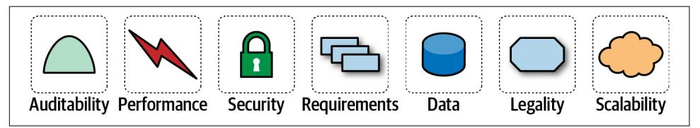

### **فصل ۴: تعریف ویژگی‌های معماری**

وقتی شرکتی تصمیم می‌گیرد مسئله‌ای را با نرم‌افزار حل کند، فهرستی از نیازمندی‌ها را برای آن سیستم گردآوری می‌کند. تکنیک‌های بسیار متنوعی برای فرآیند گردآوری نیازمندی‌ها وجود دارد که عموماً توسط تیم تعریف می‌شوند. معمار باید عوامل بسیاری را در طراحی یک راه‌حل نرم‌افزاری در نظر بگیرد.

*شکل ۴-۱. یک راه‌حل نرم‌افزاری هم از نیازمندی‌های دامنه و هم از ویژگی‌های معماری تشکیل شده است*

معماران ممکن است در تعریف نیازمندی‌های کسب‌وکار همکاری کنند، اما یکی از مسئولیت‌های کلیدی آن‌ها شامل تعریف، کشف و تحلیل تمام کارهایی است که نرم‌افزار باید انجام دهد و مستقیماً به عملکرد کسب و کار مربوط نمی‌شود.

**چه چیزی معماری نرم‌افزار را از برنامه نویسی متمایز می‌کند؟** 
موارد زیادی، از جمله نقشی که معماران در تعریف ویژگی‌های معماری دارند؛ یعنی جنبه‌های مهم سیستم که مستقل از کسب و کار هستند.

یک ویژگی معماری سه معیار را برآورده می‌کند:

 - **تعریف‌کننده یک نیازمندی غیرعملکردی (Non-Functional) است:** این ویژگی مستقیماً به منطق کسب‌وکار (Domain Logic) ارتباطی ندارد. به عبارت دیگر، به جای تمرکز بر قابلیت‌های تجاری (مانند “ثبت‌نام کاربر” یا “محاسبه فاکتور”)، بر **کیفیت** و **شرایط** اجرای آن قابلیت‌ها تمرکز دارد (مانند “سیستم باید سریع باشد” یا “سیستم باید امن باشد”).

- **دارای تأثیر ساختاری و گسترده است:** این ویژگی یک تصمیم کوچک و محلی نیست. انتخاب آن، شالوده و اسکلت اصلی سیستم را شکل می‌دهد و بر انتخاب تکنولوژی‌ها، الگوهای طراحی، و نحوه ارتباط اجزای مختلف سیستم تأثیر عمیقی می‌گذارد. نمی‌توان آن را به سادگی در انتهای پروژه “اضافه” کرد.

- **برای موفقیت کسب‌وکار، حیاتی و غیرقابل چشم‌پوشی است:** اگر این ویژگی به درستی پیاده‌سازی نشود، کل برنامه، حتی با وجود عملکرد صحیح منطق تجاری، با شکست مواجه خواهد شد. این ویژگی مستقیماً به اهداف کسب‌وکار گره خورده است.

این بخش‌های درهم‌تنیده تعریف ما در شکل ۴-۲ نشان داده شده است.

*شکل ۴-۲. ویژگی‌های متمایزکننده مشخصه‌های معماری*

#### **برای موفقیت برنامه، حیاتی یا مهم است**

برنامه‌ها *می‌توانند* از تعداد زیادی ویژگی معماری پشتیبانی کنند... اما نباید. پشتیبانی از هر ویژگی معماری به پیچیدگی طراحی می‌افزاید. بنابراین، یک کار حیاتی برای معماران، انتخاب کمترین تعداد ویژگی‌های معماری به جای بیشترین تعداد ممکن است.

در معماری نرم‌افزار، ما با دو دسته ویژگی روبرو هستیم: **ویژگی‌های صریح** که به وضوح در مستندات درخواست شده‌اند، و **ویژگی‌های ضمنی** که حیاتی هستند اما به دلیل بدیهی بودن در آن حوزه، ممکن است هرگز نوشته نشوند (مانند سرعت بالا در سیستم‌های مالی).

این وظیفه معمار است که با درک عمیق از کسب‌وکار، این نیازمندی‌های پنهان را شناسایی و در طراحی لحاظ کند.

نکته مهم این است که این ویژگی‌ها اغلب در تقابل با یکدیگر قرار دارند. به همین دلیل، معماران دائماً در حال **“بده‌بستان”** هستند؛ یعنی باید تصمیم بگیرند که برای به دست آوردن یک مزیت (مثلاً امنیت بیشتر)، کدام ویژگی دیگر (مثلاً سرعت پاسخ‌دهی) را فدا کنند تا به بهترین تعادل ممکن برای موفقیت سیستم برسند.

### **فهرست (جزئی) ویژگی‌های معماری**

ویژگی‌های معماری (از سطح کد تا عملیات) فاقد استاندارد جهانی هستند و تعاریفشان با تکامل تکنولوژی دائماً تغییر می‌کند. برای مدیریت این پیچیدگی، معماران این ویژگی‌ها را در دسته‌بندی‌های کلی سازماندهی می‌کنند تا تحلیل آن‌ها ساده‌تر شود.

#### **Operational Architecture Characteristics**
ویژگی‌های معماری که به جنبه‌های عملیاتی سیستم می‌پردازند، مرز مشترک بین دنیای معماری و دنیای DevOps هستند. در واقع، این ویژگی‌ها همان دغدغه‌هایی هستند که تیم‌های عملیات و DevOps روزانه با آن‌ها سروکار دارند و به همین دلیل، نقطه همکاری و همپوشانی این دو تخصص در یک پروژه نرم‌افزاری محسوب می‌شوند.
##### ۱. دسترس‌پذیری (Availability)

*   **تعریف ساده:** سیستم چقدر "زنده" و قابل استفاده است؟ این ویژگی به درصد زمانی که سیستم بدون قطعی کار می‌کند، اشاره دارد.

*   **توضیح کامل:** دسترس‌پذیری معمولاً با "تعداد نُه" (Nines) سنجیده می‌شود. مثلاً "پنج تا نه" (99.999%) به این معناست که سیستم در طول یک سال، تنها حدود ۵ دقیقه قطعی خواهد داشت. این معیار مستقیماً روی تجربه کاربر و درآمد کسب‌وکار تأثیر می‌گذارد. دسترس‌پذیری بالا به معنای طراحی سیستمی است که در برابر خرابی‌های رایج (مانند از کار افتادن یک سرور) مقاوم باشد.

*   **قیاس:** یک فروشگاه فیزیکی را در نظر بگیرید. دسترس‌پذیری یعنی تابلو "باز است" (Open) در ساعات کاری همیشه روشن باشد. اگر به خاطر تعمیرات جزئی مجبور شوید هر روز یک ساعت مغازه را ببندید، دسترس‌پذیری شما پایین است.

*   **مثال فنی:** استفاده از **Load Balancer** که ترافیک را بین چندین سرور پخش می‌کند. اگر یکی از سرورها از کار بیفتد، Load Balancer به صورت خودکار ترافیک را به سرورهای سالم هدایت می‌کند و کاربر نهایی متوجه قطعی نمی‌شود.

*   **بده‌بستان (Trade-off):** دسترس‌پذیری بالا بسیار **پرهزینه** است. نیاز به سخت‌افزار اضافی (Redundancy)، زیرساخت پیچیده‌تر و نگهداری تخصصی دارد.

---

##### ۲. تداوم (Continuity) و قابلیت بازیابی (Recoverability)

*   **تعریف ساده:** اگر یک **فاجعه** رخ دهد (مثلاً کل دیتاسنتر آتش بگیرد)، چقدر سریع می‌توانیم سیستم را به حالت عملیاتی برگردانیم و چقدر داده از دست می‌دهیم؟

*   **توضیح کامل:** این ویژگی فراتر از دسترس‌پذیری است. دسترس‌پذیری با خرابی‌های کوچک سروکار دارد، اما تداوم با فجایع بزرگ. در اینجا دو معیار کلیدی وجود دارد:
    *   **RTO (Recovery Time Objective):** حداکثر زمان مجازی که سیستم می‌تواند پس از فاجعه آفلاین بماند. (مثال: باید در کمتر از ۲ ساعت برگردیم.)
    *   **RPO (Recovery Point Objective):** حداکثر حجم داده‌ای که می‌توانیم از دست بدهیم. (مثال: می‌توانیم داده‌های ۵ دقیقه قبل از فاجعه را از دست بدهیم.)

*   **قیاس:** انبار اصلی یک فروشگاه زنجیره‌ای آتش می‌گیرد (فاجعه). طرح تداوم کسب‌وکار یعنی چقدر سریع می‌توانیم از انبار پشتیبان در شهر دیگر شروع به ارسال کالا کنیم (RTO) و سفارشات چند ساعت آخر قبل از آتش‌سوزی ممکن است از بین بروند (RPO).

*   **مثال فنی:** داشتن یک نسخه پشتیبان کامل از دیتابیس‌ها و سرورها در یک منطقه جغرافیایی متفاوت (مثلاً یک سرور در اروپا و یک سرور پشتیبان در آسیا).

*   **بده‌بستان:** این گران‌ترین ویژگی معماری است. داشتن یک سایت پشتیبان کاملاً فعال (Hot Site) هزینه‌ها را دو برابر می‌کند.

---

##### ۳. عملکرد (Performance)

*   **تعریف ساده:** سیستم چقدر **سریع** و **کارآمد** است؟

*   **توضیح کامل:** عملکرد فقط به معنای سرعت نیست و شامل چندین جنبه است:
    *   **زمان پاسخ (Response Time/Latency):** چقدر طول می‌کشد تا سیستم به یک درخواست پاسخ دهد (مثلاً بارگذاری یک صفحه وب در کمتر از ۵۰۰ میلی‌ثانیه).
    *   **توان عملیاتی (Throughput):** سیستم در یک واحد زمان چه تعداد درخواست را می‌تواند پردازش کند (مثلاً ۱۰۰۰ تراکنش در ثانیه).
    *   **عملکرد تحت بار (Load):** وقتی تعداد کاربران زیاد می‌شود، آیا سیستم همچنان سریع باقی می‌ماند؟

*   **قیاس:** یک رستوران. زمان پاسخ یعنی چقدر طول می‌کشد تا سفارش شما آماده شود. توان عملیاتی یعنی آشپزخانه در یک ساعت چند سفارش را می‌تواند آماده کند. عملکرد تحت بار یعنی آیا در شب‌های شلوغ آخر هفته، کیفیت و سرعت سرویس‌دهی افت می‌کند یا نه.

*   **مثال فنی:** استفاده از **کش (Caching)** برای ذخیره کردن نتایج درخواست‌های تکراری، بهینه‌سازی کوئری‌های دیتابیس، و استفاده از CDN برای تحویل سریع‌تر محتوا به کاربران.

*   **بده‌بستان:** عملکرد بالا ممکن است با **ثبات داده‌ها (Consistency)** در تضاد باشد. گاهی برای سرعت بیشتر، از ثبات آنی داده‌ها چشم‌پوشی می‌شود (Eventual Consistency).

---

##### ۴. پایایی/ایمنی (Reliability/Safety)

*   **تعریف ساده:** آیا سیستم کار درست را به طور مداوم انجام می‌دهد؟ و اگر شکست بخورد، آیا به شکل امنی شکست می‌خورد؟

*   **توضیح کامل:**
    *   **پایایی (Reliability):** به درستی و صحت عملکرد سیستم اشاره دارد. سیستمی پایدار است که نتایج قابل اعتماد و بدون خطا تولید کند. (مثلاً یک سیستم حسابداری که محاسبات را همیشه دقیق انجام می‌دهد).
    *   **ایمنی (Safety):** مربوط به سیستم‌هایی است که خرابی آن‌ها می‌تواند منجر به آسیب جانی یا خسارت‌های فاجعه‌بار شود. این سیستم‌ها باید طوری طراحی شوند که در صورت بروز خطا، به یک حالت امن وارد شوند (Fail-Safe).

*   **قیاس:**
    *   **پایایی:** ماشین حساب شما همیشه ۲+۲ را ۴ نشان می‌دهد. شما به آن اطمینان دارید.
    *   **ایمنی:** ترمزهای ایمنی آسانسور. اگر کابل اصلی پاره شود (خرابی)، این ترمزها به طور خودکار فعال می‌شوند تا از سقوط جلوگیری کنند (حالت امن).

*   **مثال فنی:** نرم‌افزار کنترل پرواز هواپیما یا سیستم کنترل یک نیروگاه هسته‌ای باید ایمنی بالایی داشته باشد. سیستم بانکی که تراکنش‌ها را مدیریت می‌کند باید پایایی بسیار بالایی داشته باشد.

*   **بده‌بستان:** دستیابی به پایایی و ایمنی فوق‌العاده بالا، نیازمند فرآیندهای تست و اعتبارسنجی بسیار سخت‌گیرانه و طولانی است که **سرعت توسعه** را به شدت کاهش می‌دهد.

---

##### ۵. استواری (Robustness)

*   **تعریف ساده:** سیستم در برابر ورودی‌های نامعتبر، خطاهای غیرمنتظره و شرایط سخت چگونه رفتار می‌کند؟

*   **توضیح کامل:** استواری یعنی توانایی مدیریت خطا. وقتی اینترنت کاربر قطع می‌شود، وقتی کاربر در یک فیلد عددی، حروف وارد می‌کند، یا وقتی یک سرویس خارجی که به آن وابسته هستیم از دسترس خارج می‌شود، آیا سیستم ما از کار می‌افتد (Crash می‌کند) یا به شکل مناسبی خطا را مدیریت کرده و به کار خود ادامه می‌دهد؟

*   **قیاس:** یک مربی رانندگی حرفه‌ای. او نه تنها در شرایط ایده‌آل خوب رانندگی می‌کند، بلکه اگر یک ماشین ناگهان جلوی او بپیچد یا جاده لغزنده باشد (شرایط مرزی و خطا)، می‌تواند ماشین را کنترل کند.

*   **مثال فنی:** استفاده از بلوک‌های `try-catch` برای مدیریت خطاها، اعتبارسنجی ورودی‌های کاربر (Input Validation)، و پیاده‌سازی الگوی **Circuit Breaker** که در صورت عدم پاسخگویی یک سرویس خارجی، ارتباط با آن را موقتاً قطع می‌کند تا کل سیستم مختل نشود.

*   **بده‌بستان:** نوشتن کد استوار، نیازمند پیش‌بینی حالات خطای مختلف و پیاده‌سازی منطق مدیریت آن‌هاست که **پیچیدگی کد** را افزایش می‌دهد.

---

##### ۶. مقیاس‌پذیری (Scalability)

*   **تعریف ساده:** آیا سیستم می‌تواند با افزایش بار (تعداد کاربران، حجم داده‌ها) رشد کند بدون اینکه عملکرد آن افت کند؟

*   **توضیح کامل:** مقیاس‌پذیری به توانایی سیستم برای مدیریت بار فزاینده به صورت کارآمد اشاره دارد. دو نوع اصلی مقیاس‌پذیری وجود دارد:
    *   **عمودی (Vertical Scaling):** افزایش منابع یک سرور (CPU، RAM بیشتر). مانند قوی‌تر کردن یک وزنه‌بردار. این روش محدودیت دارد.
    *   **افقی (Horizontal Scaling):** اضافه کردن سرورهای بیشتر. مانند اضافه کردن وزنه‌برداران بیشتر به تیم. این روش اساس معماری‌های مدرن و ابری است.

*   **قیاس:** یک غرفه کوچک فروش لیموناد مقیاس‌پذیر نیست. اگر ۱۰۰ نفر همزمان مشتری بیایند، شکست می‌خورد. اما یک رستوران زنجیره‌ای مقیاس‌پذیر است؛ با افزایش تقاضا، می‌توان شعبه‌های جدیدی افتتاح کرد (مقیاس‌پذیری افقی).

*   **مثال فنی:** طراحی **سرویس‌های بی‌حالت (Stateless)** که می‌توان به راحتی چندین نسخه از آن‌ها را پشت یک Load Balancer اجرا کرد. استفاده از معماری میکروسرویس که اجازه می‌دهد هر بخش از سیستم به صورت مستقل مقیاس‌پذیر شود.

*   **بده‌بستان:** معماری‌های مقیاس‌پذیر (مانند میکروسرویس) به طور قابل توجهی **پیچیده‌تر** از سیستم‌های یکپارچه (Monolith) هستند و مدیریت و خطایابی آن‌ها دشوارتر است.
#### **Structural Architecture Characteristics**

نقش معمار فراتر از طراحی‌های سطح بالاست و تا عمق ساختار کد نیز نفوذ می‌کند. در واقع، یکی از وظایف اصلی معمار، پذیرش مسئولیت (چه به صورت انحصاری و چه مشترک) برای کیفیت داخلی کد است. این یعنی باید اطمینان حاصل کند که کدبیس از ماژولاریتی خوبی برخوردار است، وابستگی‌ها بین اجزای مختلف به درستی مدیریت شده‌اند و کد به اندازه‌ای خوانا است که نگهداری آن در آینده آسان باشد.
##### ۱. قابلیت پیکربندی (Configurability)

*   **تعریف ساده:** کاربران نهایی (نه توسعه‌دهندگان) چقدر می‌توانند رفتار نرم‌افزار را بدون نیاز به کدنویسی تغییر دهند؟

*   **توضیح کامل:** این ویژگی به معنای فراهم کردن ابزارهایی (معمولاً یک پنل تنظیمات یا رابط کاربری) برای کاربران ادمین یا نهایی است تا بتوانند قوانین کسب‌وکار، ظاهر برنامه، یا عملکرد آن را مطابق با نیاز خودشان تنظیم کنند. این کار باعث می‌شود نرم‌افزار انعطاف‌پذیرتر باشد و برای طیف وسیع‌تری از مشتریان با نیازهای متفاوت قابل استفاده باشد.

*   **قیاس:** منوی "Settings" در گوشی موبایل شما. شما می‌توانید زنگ تماس، اندازه فونت، تصویر پس‌زمینه و نوتیفیکیشن‌ها را تغییر دهید بدون اینکه نیاز به دانش برنامه‌نویسی داشته باشید. گوشی شما "قابل پیکربندی" است.

*   **مثال فنی:** یک نرم‌افزار CRM که به مدیر سیستم اجازه می‌دهد از طریق یک فرم، مراحل مختلف فرآیند فروش را تعریف کند، فیلدهای دلخواه به فرم مشتری اضافه کند، یا الگوهای ایمیل را ویرایش کند.

*   **بده‌بستان:** پیاده‌سازی قابلیت پیکربندی، **پیچیدگی** اولیه کد را به شدت بالا می‌برد. به جای کدنویسی یک مسیر ثابت (Hard-coding)، باید منطقی بنویسید که بتواند تنظیمات را از جایی بخواند و بر اساس آن عمل کند.

---

##### ۲. توسعه‌پذیری (Extensibility)

*   **تعریف ساده:** چقدر راحت می‌توانیم قابلیت‌های **کاملاً جدید** به سیستم اضافه کنیم بدون اینکه کدهای اصلی و موجود را دستکاری کنیم؟

*   **توضیح کامل:** یک سیستم توسعه‌پذیر، مانند یک پازل است که جای خالی برای قطعات جدید دارد. این ویژگی از طریق طراحی نقاط اتصال مشخصی مانند APIها، پلاگین‌ها (Plugins)، یا سیستم‌های رویدادمحور (Event-Driven) به دست می‌آید. هدف این است که افزودن یک ویژگی جدید، کمترین تأثیر را بر روی بخش‌های پایدار و تست‌شده سیستم داشته باشد.

*   **قیاس:** مرورگر وب شما. عملکرد اصلی آن نمایش صفحات وب است، اما شما می‌توانید با نصب افزونه‌ها (Extensions) قابلیت‌های جدیدی مانند مسدودکننده تبلیغات، ابزار ترجمه، یا مدیریت رمز عبور به آن اضافه کنید، بدون اینکه خود مرورگر را تغییر دهید.

*   **مثال فنی:** سیستم **پلاگین** در نرم‌افزاری مانند وردپرس یا VS Code. شما می‌توانید یک پلاگین جدید بنویسید و آن را به سیستم اضافه کنید تا یک قابلیت جدید (مثلاً یک درگاه پرداخت جدید) به سایت اضافه شود.

*   **بده‌بستان:** طراحی یک معماری توسعه‌پذیر نیازمند **صرف زمان و تفکر زیاد در ابتدای پروژه** است. تعریف APIها و نقاط اتصال مناسب، کار دشواری است.

---

##### ۳. قابلیت نصب (Installability)

*   **تعریف ساده:** فرآیند نصب و راه‌اندازی اولیه نرم‌افزار چقدر سریع، ساده و بدون خطا است؟

*   **توضیح کامل:** این ویژگی تمام مراحل از دانلود تا اولین اجرای موفق نرم‌افزار را در بر می‌گیرد. مواردی مانند مدیریت وابستگی‌ها (Dependencies)، پیکربندی‌های اولیه، و سازگاری با سیستم‌عامل‌ها و پلتفرم‌های مختلف در این دسته قرار می‌گیرند. در دنیای SaaS (نرم‌افزار به عنوان سرویس)، این مفهوم کمتر مطرح است، اما برای نرم‌افزارهای On-Premise (که روی سرور مشتری نصب می‌شوند) بسیار حیاتی است.

*   **قیاس:** نصب یک اپلیکیشن از اپ استور روی گوشی (قابلیت نصب بسیار بالا) در مقابل مونتاژ یک وسیله پیچیده با صدها قطعه و دفترچه راهنمای نامفهوم (قابلیت نصب بسیار پایین).

*   **مثال فنی:** ارائه یک **تصویر داکر (Docker Image)** برای نرم‌افزار که تمام وابستگی‌ها و پیکربندی‌ها را در خود دارد، قابلیت نصب را به شدت افزایش می‌دهد. کاربر فقط با یک دستور `docker run` می‌تواند نرم‌افزار را راه‌اندازی کند.

*   **بده‌بستان:** ساختن یک نصب‌کننده (Installer) خوب و بی‌دردسر برای پلتفرم‌های مختلف، خود یک پروژه نرم‌افزاری جداگانه است و نیازمند **زمان و تخصص** است.

---

##### ۴. قابلیت اهرم‌سازی/استفاده مجدد (Leverageability/Reuse)

*   **تعریف ساده:** چقدر می‌توانیم از کدها یا کامپوننت‌های نوشته شده در این پروژه، در پروژه‌های آینده نیز استفاده کنیم؟

*   **توضیح کامل:** این ویژگی به اصل **"خودت را تکرار نکن" (DRY - Don't Repeat Yourself)** در مقیاس بزرگ اشاره دارد. هدف این است که منطق‌های مشترک کسب‌وکار (مانند احراز هویت، پرداخت، ارسال نوتیفیکیشن) به صورت ماژول‌ها یا سرویس‌های مستقل طراحی شوند تا بتوان آن‌ها را در چندین محصول یا پروژه مختلف شرکت به کار برد.

*   **قیاس:** استفاده از یک نوع موتور و شاسی استاندارد توسط یک شرکت خودروسازی برای ساخت چندین مدل مختلف ماشین (سدان، هاچ‌بک، شاسی‌بلند).

*   **مثال فنی:** یک شرکت، یک میکروسرویس مستقل برای **احراز هویت (Authentication)** می‌سازد. سپس اپلیکیشن وب، اپلیکیشن موبایل، و پنل ادمین داخلی، همگی از همین سرویس مشترک برای ورود کاربران استفاده می‌کنند.

*   **بده‌بستان:** ساخت یک کامپوننت قابل استفاده مجدد، **زمان‌برتر و پیچیده‌تر** از ساخت یک راه‌حل یکبار مصرف است، زیرا باید عمومی‌تر، مستندتر و با کیفیت بالاتری طراحی شود.

---

##### ۵. محلی‌سازی (Localization - L10n)

*   **تعریف ساده:** تطبیق نرم‌افزار برای استفاده در مناطق جغرافیایی و فرهنگی مختلف.

*   **توضیح کامل:** محلی‌سازی فراتر از ترجمه متن رابط کاربری است. این ویژگی شامل موارد زیر می‌شود:
    *   پشتیبانی از فرمت‌های مختلف تاریخ و زمان (e.g., `MM/DD/YYYY` vs. `DD.MM.YYYY`).
    *   فرمت‌های عددی و واحدهای پولی (e.g., `1,000.50` vs. `1.000,50`).
    *   پشتیبانی از زبان‌های راست‌به‌چپ (RTL) مانند فارسی و عربی.
    *   واحدهای اندازه‌گیری (متریک در مقابل امپریال).
    *   ملاحظات فرهنگی در تصاویر و آیکون‌ها.

*   **قیاس:** شعبه‌های مک‌دونالد در کشورهای مختلف. در هند، به جای گوشت گاو، از مرغ استفاده می‌کند و منوهای متناسب با ذائقه محلی ارائه می‌دهد.

*   **مثال فنی:** استفاده از کتابخانه‌های **i18n (Internationalization)** که به شما اجازه می‌دهند تمام متون برنامه را در فایل‌های جداگانه برای هر زبان (`en.json`, `fa.json`) ذخیره کنید و بر اساس زبان کاربر، متن مناسب را نمایش دهید.

*   **بده‌بستان:** محلی‌سازی نیازمند **هزینه (برای ترجمه)** و **پیچیدگی فنی** قابل توجهی است و فرآیند تست را بسیار گسترده‌تر می‌کند.

---

##### ۶. قابلیت نگهداری (Maintainability)

*   **تعریف ساده:** چقدر راحت می‌توانیم باگ‌ها را رفع کنیم، تغییرات کوچک اعمال کنیم یا کد را بهبود دهیم؟

*   **توضیح کامل:** این ویژگی به سلامت داخلی و کیفیت کدبیس اشاره دارد. کدی که خوانا، ماژولار، مستند و دارای تست‌های خودکار باشد، قابلیت نگهداری بالایی دارد. هدف این است که هزینه و ریسک ایجاد تغییرات در آینده به حداقل برسد.

*   **قیاس:** یک موتور ماشین تمیز و مرتب که تمام قطعات آن به راحتی در دسترس هستند (نگهداری بالا) در مقابل یک موتور کثیف و به‌هم‌ریخته که برای تعویض یک شمع باید نیمی از قطعات را باز کنید (نگهداری پایین).

*   **مثال فنی:** پیروی از اصول **SOLID**، نوشتن **Unit Test** برای منطق‌های کلیدی، داشتن **کد خوانا** با نام‌گذاری مناسب متغیرها، و تقسیم کردن سیستم به ماژول‌های کوچک و مستقل.

*   **بده‌بستان:** نوشتن کد تمیز و تست‌شده در ابتدا **زمان بیشتری** می‌برد، اما این زمان در بلندمدت با کاهش هزینه نگهداری، جبران می‌شود.

---

##### ۷. قابلیت حمل (Portability)

*   **تعریف ساده:** چقدر راحت می‌توانیم نرم‌افزار را از یک محیط (مثلاً یک سیستم‌عامل یا پایگاه‌داده) به محیطی دیگر منتقل کنیم؟

*   **توضیح کامل:** این ویژگی به عدم وابستگی شدید نرم‌افزار به یک تکنولوژی یا پلتفرم خاص اشاره دارد. اگر کد شما پر از کوئری‌های مخصوص پایگاه‌داده Oracle باشد، انتقال آن به PostgreSQL بسیار دشوار خواهد بود.

*   **قیاس:** یک شارژر موبایل با آداپتورهای مختلف برای پریزهای برق کشورهای گوناگون. این شارژر قابل حمل بین‌المللی است.

*   **مثال فنی:** استفاده از یک **ORM (Object-Relational Mapper)** مانند Eloquent در لاراول یا GORM در Go. این لایه انتزاعی، کد شما را از پایگاه‌داده خاص مستقل می‌کند و شما می‌توانید با تغییرات جزئی در پیکربندی، از MySQL به PostgreSQL مهاجرت کنید.

*   **بده‌بستان:** استفاده از لایه‌های انتزاعی (Abstraction Layers) ممکن است کمی **عملکرد (Performance)** را کاهش دهد و شما را از برخی قابلیت‌های خاص و بهینه یک پلتفرم محروم کند.

---

##### ۸. قابلیت پشتیبانی (Supportability)

*   **تعریف ساده:** وقتی مشکلی در محیط عملیاتی (Production) پیش می‌آید، چقدر راحت می‌توانیم علت آن را پیدا و رفع کنیم؟

*   **توضیح کامل:** این ویژگی به ابزارهایی مربوط می‌شود که برای تیم پشتیبانی و توسعه‌دهندگان فراهم می‌کنیم تا بتوانند سلامت سیستم را رصد کرده و خطاها را ریشه‌یابی کنند. این شامل لاگ‌گیری (Logging)، مانیتورینگ (Monitoring)، ردیابی (Tracing) و هشدارهای خودکار (Alerting) می‌شود.

*   **قیاس:** داشبورد ماشین شما. چراغ‌های هشدار (چک موتور، روغن، بنزین) و آمپرها به شما اطلاعات لازم برای تشخیص مشکل را می‌دهند. بدون آن‌ها، باید کل ماشین را باز کنید تا بفهمید چرا حرکت نمی‌کند.

*   **مثال فنی:** ثبت **لاگ‌های ساختاریافته (Structured Logs)** با جزئیات کامل (مانند Request ID، User ID)، ارسال متریک‌های عملکردی (زمان پاسخ، مصرف CPU) به ابزاری مانند Prometheus، و تنظیم هشدارهایی در Grafana که در صورت بروز خطا، به تیم پشتیبانی اطلاع دهد.

*   **بده‌بستان:** پیاده‌سازی یک سیستم جامع لاگ و مانیتورینگ، نیازمند **زیرساخت و هزینه** است و می‌تواند کمی بر عملکرد کلی سیستم تأثیر بگذارد.

---

##### ۹. قابلیت ارتقا (Upgradeability)

*   **تعریف ساده:** چقدر راحت می‌توانیم نرم‌افزار را از نسخه فعلی به نسخه جدیدتر به‌روزرسانی کنیم؟

*   **توضیح کامل:** این فرآیند باید تا حد امکان خودکار، سریع و بدون قطعی (Zero-Downtime) باشد. این ویژگی شامل به‌روزرسانی کد برنامه، تغییرات اسکیمای پایگاه‌داده (Database Migrations) و به‌روزرسانی وابستگی‌ها می‌شود.

*   **قیاس:** به‌روزرسانی سیستم‌عامل گوشی شما. شما یک نوتیفیکیشن دریافت می‌کنید، روی دکمه "Update" کلیک می‌کنید و پس از چند دقیقه، نسخه جدید با تمام داده‌های شما نصب شده است.

*   **مثال فنی:** استفاده از استراتژی‌های استقرار مانند **Blue-Green Deployment** یا **Canary Releases** که به شما اجازه می‌دهند نسخه جدید را بدون قطعی و با کمترین ریسک جایگزین نسخه قدیمی کنید. داشتن یک سیستم Migration قوی برای مدیریت تغییرات دیتابیس نیز حیاتی است.

*   **بده‌بستان:** پیاده‌سازی ارتقاهای بدون قطعی نیازمند **زیرساخت پیچیده و ابزارهای DevOps پیشرفته** است.

#### **Cross-Cutting Architecture Characteristics**
در حالی که بخش عمده‌ای از ویژگی‌های معماری در دسته‌بندی‌های مشخصی جای می‌گیرند، گروه دیگری از ویژگی‌ها وجود دارند که یا خارج از این چارچوب‌ها قرار می‌گیرند یا اساساً قابلیت دسته‌بندی ندارند. با این وجود، این ویژگی‌ها محدودیت‌ها و ملاحظات طراحی مهمی را تشکیل می‌دههند. جدول ۴-۳ به تشریح شماری از این موارد می‌پردازد.
##### ۱. دسترس‌پذیری (Accessibility - a11y)

- **تعریف ساده:** طراحی نرم‌افزار برای **همه**، فارغ از توانایی‌های جسمی، ذهنی یا حسی آن‌ها.
    
- **توضیح کامل:** این ویژگی تضمین می‌کند که افرادی با معلولیت‌های مختلف بتوانند به راحتی از محصول شما استفاده کنند. این معلولیت‌ها شامل موارد زیر است:
    
    - **بینایی:** نابینایی، کم‌بینایی، کوررنگی.
    - **شنوایی:** ناشنوایی، کم‌شنوایی.
    - **حرکتی:** ناتوانی در استفاده از ماوس یا کیبورد به شکل معمول.
    - **شناختی:** ناتوانی‌های یادگیری یا مشکل در تمرکز. پیاده‌سازی Accessibility اغلب به معنای پیروی از استانداردهایی مانند **WCAG (Web Content Accessibility Guidelines)** است.
- **قیاس:** یک ساختمان عمومی مدرن. ورودی ساختمان باید رمپ برای ویلچر داشته باشد (حرکتی)، دکمه‌های آسانسور باید خط بریل داشته باشند (بینایی)، و هشدارهای آتش‌سوزی باید هم صوتی و هم نوری باشند (شنوایی).
    
- **مثال فنی:**
    
    - قراردادن متن جایگزین (`alt` text) برای تمام تصاویر تا نرم‌افزارهای صفحه‌خوان (Screen Reader) بتوانند تصویر را برای کاربران نابینا توصیف کنند.
    - اطمینان از اینکه تمام قابلیت‌های سایت با کیبورد قابل استفاده هستند (بدون نیاز به ماوس).
    - استفاده از کنتراست رنگی مناسب بین متن و پس‌زمینه برای کاربران کم‌بینا.
- **بده‌بستان (Trade-off):** پیاده‌سازی کامل Accessibility نیازمند **زمان توسعه و تست بیشتر** است. گاهی ممکن است با برخی طراحی‌های بصری پیچیده در تضاد باشد.
    

---

##### ۲. قابلیت بایگانی (Archivability)

- **تعریف ساده:** استراتژی ما برای مدیریت داده‌های قدیمی و غیرفعال چیست؟ آن‌ها را حذف می‌کنیم یا برای استفاده‌های آتی در جایی دیگر ذخیره می‌کنیم؟
    
- **توضیح کامل:** با گذشت زمان، حجم داده‌ها در یک سیستم افزایش می‌یابد. نگهداری داده‌های قدیمی که به ندرت استفاده می‌شوند در پایگاه داده اصلی (Production Database) می‌تواند باعث **کاهش عملکرد** و **افزایش هزینه‌های نگهداری** شود. قابلیت بایگانی به فرآیند انتقال این داده‌ها به یک فضای ذخیره‌سازی ارزان‌تر و بلندمدت (Cold Storage) اشاره دارد، در حالی که امکان بازیابی آن‌ها در صورت نیاز وجود داشته باشد.
    
- **قیاس:** یک دفتر کار. اسناد و پرونده‌های فعال روی میز و در کشوهای نزدیک نگهداری می‌شوند (دیتابیس اصلی). اما پرونده‌های مربوط به ۵ سال پیش به انبار بایگانی در زیرزمین منتقل می‌شوند (بایگانی). دسترسی به آن‌ها کندتر است، اما فضای میز کار را اشغال نمی‌کنند.
    
- **مثال فنی:** یک سیستم می‌تواند یک فرآیند خودکار (Cron Job) داشته باشد که هر شب اجرا شود و سفارش‌های مشتریانی که بیش از ۳ سال از آن‌ها گذشته و وضعیتشان “تکمیل شده” است را از دیتابیس اصلی PostgreSQL به یک سرویس ذخیره‌سازی ارزان مانند Amazon S3 Glacier منتقل کند و سپس از دیتابیس اصلی حذف نماید.
    
- **بده‌بستان:** پیاده‌سازی منطق بایگانی، **پیچیدگی** به سیستم اضافه می‌کند. همچنین، فرآیند بازیابی و گزارش‌گیری از داده‌های بایگانی شده پیچیده‌تر و کندتر از داده‌های فعال است.
    

---

##### ۳. احراز هویت (Authentication - AuthN)

- **تعریف ساده:** فرآیند تأیید هویت یک کاربر. سیستم می‌پرسد: **“شما چه کسی هستید؟”** و کاربر باید هویت خود را اثبات کند.
    
- **توضیح کامل:** این اولین لایه امنیت است. روش‌های احراز هویت معمولاً بر اساس یک یا چند مورد از این عوامل هستند:
    
    - **چیزی که می‌دانید:** رمز عبور، پین‌کد.
    - **چیزی که دارید:** گوشی موبایل (برای دریافت کد یکبار مصرف)، توکن سخت‌افزاری.
    - **چیزی که هستید:** اثر انگشت، تشخیص چهره (بیومتریک). استفاده همزمان از چند عامل، **احراز هویت چندعاملی (MFA)** نامیده می‌شود که امنیت را به شدت افزایش می‌دهد.
- **قیاس:** نشان دادن کارت شناسایی در ورودی یک اداره. نگهبان هویت شما را با عکس و اطلاعات روی کارت تطبیق می‌دهد تا اجازه ورود بدهد.
    
- **مثال فنی:** کاربر نام کاربری و رمز عبور خود را در فرم ورود وارد می‌کند. سرور، رمز عبور وارد شده را با استفاده از یک الگوریتم امن مانند `bcrypt` هش کرده و با مقدار هش ذخیره شده در دیتابیس مقایسه می‌کند. اگر مطابقت داشت، یک توکن (مانند JWT) برای کاربر صادر می‌کند که در درخواست‌های بعدی برای شناسایی او استفاده می‌شود.
    
- **بده‌بستان:** افزایش امنیت احراز هویت (مانند اجباری کردن MFA) می‌تواند **اصطکاک و پیچیدگی را برای کاربر نهایی** افزایش دهد (User Experience vs. Security).
    

---

##### ۴. مجوزدهی (Authorization - AuthZ)

- **تعریف ساده:** پس از اینکه هویت کاربر تأیید شد، سیستم می‌پرسد: **“شما مجاز به انجام چه کارهایی هستید؟”**
    
- **توضیح کامل:** مجوزدهی فرآیند کنترل دسترسی به منابع و قابلیت‌های سیستم است. این فرآیند تعیین می‌کند که یک کاربر احراز هویت شده، چه سطحی از دسترسی دارد. برای مثال، یک کاربر عادی ممکن است فقط بتواند پروفایل خود را ببیند، اما یک کاربر ادمین بتواند پروفایل تمام کاربران را ویرایش کند. مدل‌های رایج مجوزدهی شامل **RBAC (Role-Based Access Control)** است که در آن دسترسی‌ها بر اساس نقش کاربر (مانند ادمین، ویرایشگر، کاربر عادی) تعریف می‌شوند.
    
- **قیاس:** کارت ورود کارمندان در یک شرکت. این کارت (که هویت شما را تأیید کرده) فقط درهای خاصی را باز می‌کند. شما می‌توانید وارد اتاق خود شوید، اما نمی‌توانید وارد اتاق مدیرعامل یا اتاق سرور شوید.
    
- **مثال فنی:** در یک اپلیکیشن وب، وقتی کاربری با نقش “نویسنده” تلاش می‌کند تا به صفحه مدیریت کاربران (`/admin/users`) دسترسی پیدا کند، یک **Middleware** یا **Policy** در سمت سرور نقش کاربر را بررسی کرده و چون این نقش مجوز لازم را ندارد، درخواست را رد کرده و خطای “403 Forbidden” را برمی‌گرداند.
    
- **بده‌بستان:** طراحی یک سیستم مجوزدهی بسیار دقیق و دانه‌ریز (Fine-grained)، **پیچیدگی فنی و مدیریتی** زیادی را به سیستم تحمیل می‌کند.
    

---

##### ۵. قانونی (Legal)

- **تعریف ساده:** نرم‌افزار باید از چه قوانین، مقررات و استانداردهای صنعتی پیروی کند؟
    
- **توضیح کامل:** این ویژگی به انطباق (Compliance) نرم‌افزار با الزامات قانونی حاکم بر حوزه کسب‌وکار یا مناطق جغرافیایی که در آن فعالیت می‌کند، اشاره دارد. نادیده گرفتن این الزامات می‌تواند منجر به جریمه‌های سنگین مالی، توقف فعالیت یا حتی پیگرد قانونی شود.
    
    - **GDPR:** قوانین حفاظت از داده‌های شهروندان اتحادیه اروپا.
    - **HIPAA:** قوانین مربوط به حریم خصوصی اطلاعات پزشکی در آمریکا.
    - **قوانین مربوط به لایسنس نرم‌افزار:** رعایت شرایط استفاده از کتابخانه‌های متن‌باز (Open Source).
    - **قوانین مالی:** مانند Sarbanes-Oxley (SOX) برای شرکت‌های سهامی عام.
- **قیاس:** یک شرکت داروسازی. قبل از اینکه بتواند یک داروی جدید را بفروشد، باید فرآیندهای بسیار سخت‌گیرانه و طولانی سازمان غذا و دارو (FDA) را طی کند تا تأییدیه‌های لازم را بگیرد. این‌ها الزامات قانونی صنعت آن‌هاست.
    
- **مثال فنی:** برای انطباق با **GDPR**، سیستم باید قابلیتی به نام **“حق فراموش شدن” (Right to be Forgotten)** را پیاده‌سازی کند. این یعنی باید یک فرآیند فنی وجود داشته باشد که در صورت درخواست کاربر، تمام اطلاعات شخصی او از همه دیتابیس‌ها، لاگ‌ها و سیستم‌های پشتیبان به طور کامل حذف شود.
    
- **بده‌بستان:** انطباق با قوانین، اغلب **محدودیت‌های فنی شدیدی** را به معماری تحمیل می‌کند (مثلاً الزام به نگهداری داده‌ها در یک منطقه جغرافیایی خاص) و **هزینه‌های توسعه و نگهداری** را به طور قابل توجهی افزایش می‌دهد.

حتماً! این مجموعه از ویژگی‌ها به شدت بر تجربه کاربر، امنیت داده‌ها و چرخه عمر نرم‌افزار تأثیرگذار هستند. در ادامه، هر کدام را به صورت کامل توضیح می‌دهم.

---

##### ۶. حریم خصوصی (Privacy)

*   **تعریف ساده:** محافظت از داده‌های حساس کاربران، حتی در برابر افراد مجاز **داخلی** شرکت (مانند مدیران سیستم یا دیتابیس).

*   **توضیح کامل:** این ویژگی یک سطح عمیق‌تر از امنیت است. امنیت معمولاً به محافظت در برابر تهدیدات خارجی (هکرها) می‌پردازد، اما حریم خصوصی بر این تمرکز دارد که حتی کارمندان خود شرکت که به زیرساخت‌ها دسترسی دارند، نتوانند محتوای داده‌های حساس را مشاهده کنند. این کار معمولاً از طریق رمزنگاری قوی در سطح اپلیکیشن (Client-Side Encryption) یا رمزنگاری سرتاسری (End-to-End Encryption) انجام می‌شود، جایی که کلیدهای رمزگشایی هرگز در اختیار سرور یا مدیران آن قرار نمی‌گیرد.

*   **قیاس:** صندوق امانات بانک. کارمند بانک (مدیر سیستم) می‌تواند شما را تا درب گاوصندوق همراهی کند و دسترسی فیزیکی به آن دارد، اما کلید باز کردن خود صندوق فقط در اختیار شما (کاربر) است. کارمند بانک نمی‌تواند محتویات صندوق شما را ببیند.

*   **مثال فنی:** اپلیکیشن‌های پیام‌رسان مانند Signal یا WhatsApp. پیام شما روی دستگاه خودتان رمزگذاری می‌شود و فقط روی دستگاه گیرنده قابل رمزگشایی است. سرورهای شرکت فقط بسته‌های رمزگذاری شده را جابجا می‌کنند و نمی‌توانند محتوای پیام‌ها را بخوانند. مثال دیگر، رمزگذاری یک فیلد خاص (مانند شماره کارت ملی) در اپلیکیشن *قبل* از ارسال آن به دیتابیس است. در این حالت، مدیر دیتابیس فقط یک رشته درهم‌ریخته و بی‌معنی می‌بیند.

*   **بده‌بستان (Trade-off):** پیاده‌سازی حریم خصوصی در این سطح، **بسیار پیچیده و پرهزینه** است. این کار می‌تواند قابلیت‌های مهمی مانند جستجو در سمت سرور یا گزارش‌گیری بر روی داده‌های حساس را تقریباً غیرممکن کند، زیرا سرور نمی‌تواند محتوای داده‌ها را درک کند.

---

##### ۷. امنیت (Security)

*   **تعریف ساده:** محافظت کلی سیستم و داده‌های آن در برابر دسترسی، تغییر یا تخریب **غیرمجاز**.

*   **توضیح کامل:** امنیت یک مفهوم گسترده است که حریم خصوصی، احراز هویت و مجوزدهی را نیز در بر می‌گیرد. امنیت بر سه اصل کلیدی استوار است (CIA Triad):
    1.  **محرمانگی (Confidentiality):** اطمینان از اینکه داده‌ها فقط توسط افراد مجاز قابل مشاهده هستند. (مثال: رمزنگاری)
    2.  **یکپارچگی (Integrity):** اطمینان از اینکه داده‌ها در حین انتقال یا ذخیره‌سازی به صورت غیرمجاز تغییر نکرده‌اند. (مثال: استفاده از هش و امضای دیجیتال)
    3.  **در دسترس بودن (Availability):** اطمینان از اینکه سیستم و داده‌ها در زمان نیاز در دسترس کاربران مجاز هستند. (مثال: مقابله با حملات DDoS)

*   **قیاس:** یک قلعه نظامی. دارای دیوارهای بلند (Firewall)، نگهبانان در ورودی (Authentication)، کلیدهای مختلف برای اتاق‌های متفاوت (Authorization)، رمزنگاری نامه‌ها (Encryption in Transit) و نگهداری اسناد مهم در گاوصندوق (Encryption at Rest) است.

*   **مثال فنی:**
    *   **Encryption in Transit:** استفاده از پروتکل HTTPS (مبتنی بر TLS/SSL) برای تمام ارتباطات بین کلاینت و سرور.
    *   **Encryption at Rest:** فعال کردن قابلیت رمزنگاری روی سرویس پایگاه داده (مانند Amazon RDS Encryption) تا اگر کسی به دیسک فیزیکی سرور دسترسی پیدا کرد، نتواند داده‌ها را بخواند.
    *   انجام تست‌های نفوذ (Penetration Testing) به صورت دوره‌ای برای پیدا کردن و رفع حفره‌های امنیتی.

*   **بده‌بستان:** امنیت تقریباً همیشه با **عملکرد (Performance)** و **راحتی کاربر (Usability)** در تضاد است. فرآیندهای رمزنگاری و رمزگشایی سربار پردازشی ایجاد می‌کنند و مراحل امنیتی بیشتر (مانند MFA) یک گام اضافی برای کاربر ایجاد می‌کنند.

---

##### ۸. قابلیت پشتیبانی (Supportability)

*   **تعریف ساده:** زمانی که مشکلی در سیستم رخ می‌دهد، چقدر راحت می‌توانیم علت آن را پیدا کرده و آن را برطرف کنیم؟

*   **توضیح کامل:** این ویژگی به ابزارها و فرآیندهایی اشاره دارد که به تیم‌های پشتیبانی و توسعه اجازه می‌دهند تا سلامت سیستم را نظارت کرده و خطاها را در محیط عملیاتی (Production) ریشه‌یابی کنند. یک سیستم با قابلیت پشتیبانی بالا، دید کاملی از اتفاقات درون خود ارائه می‌دهد. اجزای اصلی آن عبارتند از:
    *   **لاگ‌گیری (Logging):** ثبت وقایع مهم و خطاها با جزئیات کافی.
    *   **مانیتورینگ (Monitoring):** جمع‌آوری و نمایش شاخص‌های کلیدی عملکرد (مانند مصرف CPU، زمان پاسخگویی) به صورت زنده.
    *   **هشداردهی (Alerting):** اطلاع‌رسانی خودکار به تیم پشتیبانی در صورت عبور شاخص‌ها از یک آستانه بحرانی.
    *   **ردیابی (Tracing):** امکان دنبال کردن یک درخواست از ابتدا تا انتها در میان سرویس‌های مختلف (در معماری میکروسرویس).

*   **قیاس:** جعبه سیاه یک هواپیما. وقتی حادثه‌ای رخ می‌دهد، کارشناسان با تحلیل اطلاعات ضبط شده در جعبه سیاه می‌توانند دقیقاً بفهمند که چه اتفاقی و در چه زمانی رخ داده است. لاگ‌ها و متریک‌ها، جعبه سیاه نرم‌افزار شما هستند.

*   **مثال فنی:** استفاده از ابزاری مانند Datadog یا ELK Stack. اپلیکیشن شما **لاگ‌های ساختاریافته (Structured Logs)** در فرمت JSON تولید می‌کند که شامل یک `trace_id` منحصر به فرد برای هر درخواست است. این به تیم پشتیبانی اجازه می‌دهد تمام لاگ‌های مربوط به یک درخواست خاص را در میان چندین میکروسرویس فیلتر کرده و مشکل را به سرعت پیدا کند.

*   **بده‌بستان:** پیاده‌سازی یک زیرساخت کامل برای لاگ و مانیتورینگ، نیازمند **هزینه (برای ابزار و ذخیره‌سازی)** است و می‌تواند مقدار کمی **سربار عملکردی** به سیستم اضافه کند.

---

##### ۹. قابلیت استفاده/دستیابی (Usability/Achievability)

*   **تعریف ساده:** نرم‌افزار چقدر برای کاربر نهایی، **ساده، قابل فهم و لذت‌بخش** است تا بتواند به اهدافش برسد؟

*   **توضیح کامل:** این ویژگی، که هسته اصلی **تجربه کاربری (UX)** است، بر خلاف بسیاری از ویژگی‌های دیگر، مستقیماً با احساسات و درک انسان سروکار دارد. یک سیستم با Usability بالا، دارای **منحنی یادگیری پایین** است؛ یعنی کاربر به سرعت و بدون نیاز به آموزش طولانی، می‌تواند از آن استفاده کند. "Achievability" (قابلیت دستیابی) بر این نکته تأکید دارد که آیا طراحی سیستم به کاربر کمک می‌کند تا وظیفه‌اش را به طور مؤثر و موفق به پایان برساند یا مانع او می‌شود.

*   **قیاس:** تفاوت بین کنترل تلویزیون اپل (Apple TV Remote) با تعداد دکمه‌های کم و عملکرد بصری، در مقابل یک کنترل تلویزیون قدیمی با ۵۰ دکمه که بیشتر آن‌ها هرگز استفاده نمی‌شوند و کاربر را گیج می‌کنند. هر دو یک کار را انجام می‌دهند، اما usability آن‌ها زمین تا آسمان متفاوت است.

*   **مثال فنی:**
    *   ارائه پیام‌های خطای واضح و کاربردی. به جای نمایش "خطای شماره 54B-1"، پیامی مانند "ایمیل وارد شده تکراری است. لطفاً از ایمیل دیگری استفاده کنید یا وارد حساب کاربری خود شوید" نمایش داده شود.
    *   انجام تست‌های کاربردپذیری (Usability Testing) که در آن کاربران واقعی در حین کار با یک نمونه اولیه (Prototype) مشاهده می‌شوند تا نقاط گیج‌کننده و مشکلات طراحی شناسایی شوند.
    *   طراحی یک فرآیند ثبت‌نام چند مرحله‌ای ساده به جای یک فرم طولانی و خسته‌کننده.

*   **بده‌بستان:** دستیابی به قابلیت استفاده بالا نیازمند سرمایه‌گذاری قابل توجه در **تحقیق، طراحی UX/UI، و توسعه فرانت‌اند** است که می‌تواند زمان و هزینه پروژه را افزایش دهد. گاهی ساده‌ترین طرح برای کاربر، پیچیده‌ترین پیاده‌سازی را در سمت سرور دارد.

#### **ابهامات فراوان در معماری نرم‌افزار**

یکی از چالش‌های همیشگی معماران نرم‌افزار، نبود یک واژه‌نامه استاندارد و جهانی است. مفاهیم حیاتی، حتی خودِ «معماری نرم‌افزار»، تعاریف مشخص و یکسانی ندارند. این وضعیت باعث شده هر شرکت زبان خودش را بسازد و در نتیجه، در سطح صنعت با سردرگمی مواجه شویم؛ جایی که یک اصطلاح واحد، معانی متفاوتی دارد.

از آنجا که تحمیل یک استاندارد جهانی غیرممکن است، بهترین راهکار را می‌توان از رویکرد «طراحی دامنه-محور» (DDD) الهام گرفت. این رویکرد توصیه می‌کند که هر تیم یک **«زبان فراگیر» (Ubiquitous Language)** برای خود ایجاد کند. با استفاده از این زبان مشترک و دقیق در تمام مکالمات و مستندات، می‌توان از سوءتفاهم‌های ناشی از اصطلاحات مبهم جلوگیری کرد و اطمینان یافت که همه اعضای تیم درک یکسانی از مفاهیم دارند.

#### **بده‌بستان‌ها و معماری کمترین-بدی**

در دنیای واقعی، ساختن یک نرم‌افزار که همزمان فوق‌العاده امن، سریع، مقیاس‌پذیر و ارزان باشد، غیرممکن است. دلیلش ساده است: این ویژگی‌ها با هم تضاد دارند. وقتی امنیت را با رمزنگاری‌های سنگین بالا می‌برید، سرعت سیستم پایین می‌آید. این یک بده‌بستان اجتناب‌ناپذیر است.

این فرآیند مثل خلبانی هلیکوپتر است؛ یک تمرین مداوم برای ایجاد تعادل. به همین دلیل، یک معمار خوب به دنبال یک راه‌حل “بی‌نقص” نمی‌گردد، بلکه به دنبال معماری **“کمترین-بدی”** است؛ یعنی طرحی که بهترین تعادل ممکن را بین خواسته‌های متضاد برقرار کند.

تلاش برای راضی کردن همه، به معماری پیچیده و سنگینی منجر می‌شود که در نهایت هیچ کاری را به درستی انجام نمی‌دهد. راه حل چیست؟ **چابک بودن.** معماری را باید طوری طراحی کرد که بتوان آن را به مرور زمان و به صورت تکرارشونده بهبود داد. این کار به شما اجازه می‌دهد که با کمترین استرس شروع کنید و با یادگیری بیشتر، طراحی خود را تکامل دهید.