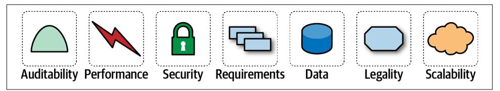
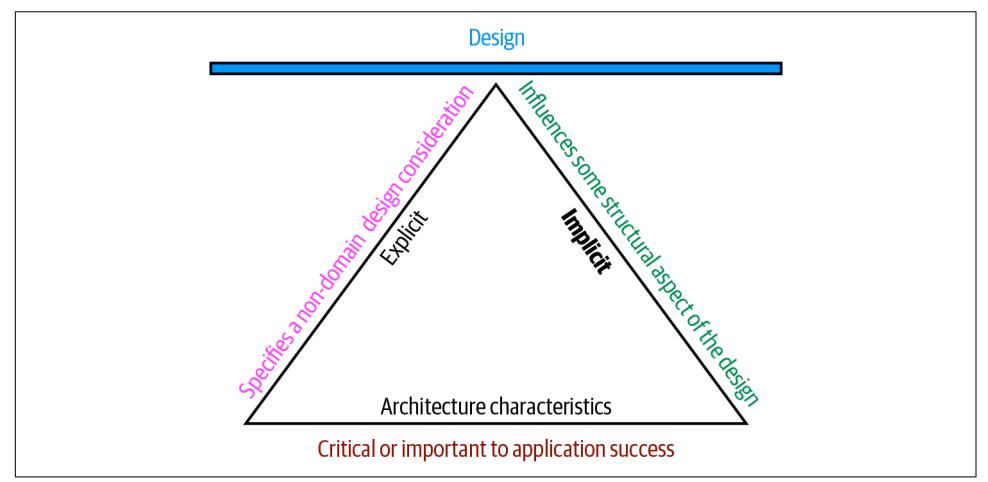

## **CHAPTER 4 Architecture Characteristics Defined**

A company decides to solve a particular problem using software, so it gathers a list of requirements for that system. A wide variety of techniques exist for the exercise of requirements gathering, generally defined by the software development process used by the team. But the architect must consider many other factors in designing a soft‐ ware solution, as illustrated in Figure 4-1.

*Figure 4-1. A soware solution consists of both domain requirements and architectural characteristics*

Architects may collaborate on defining the domain or business requirements, but one key responsibility entails defining, discovering, and otherwise analyzing all the things the software must do that isn't directly related to the domain functionality: *architec‐ tural characteristics*.

What distinguishes software architecture from coding and design? Many things, including the role that architects have in defining architectural characteristics, the important aspects of the system independent of the problem domain. Many organiza‐ tions describe these features of software with a variety of terms, including *nonfunc‐ tional requirements*, but we dislike that term because it is self-denigrating. Architects created that term to distinguish architecture characteristics from *functional require‐ ments*, but naming something *nonfunctional* has a negative impact from a language standpoint: how can teams be convinced to pay enough attention to something "non‐ functional"? Another popular term is *quality attributes*, which we dislike because it implies after-the-fact quality assessment rather than design. We prefer *architecture characteristics* because it describes concerns critical to the success of the architecture, and therefore the system as a whole, without discounting its importance.

An architecture characteristic meets three criteria:

- Specifies a nondomain design consideration
- Influences some structural aspect of the design
- Is critical or important to application success

These interlocking parts of our definition are illustrated in Figure 4-2.

*Figure 4-2. The differentiating features of architecture characteristics*

The definition illustrated in Figure 4-2 consists of the three components listed, in addition to a few modifiers:

#### *Species a nondomain design consideration*

When designing an application, the requirements specify what the application should do; architecture characteristics specify operational and design criteria for success, concerning how to implement the requirements and why certain choices were made. For example, a common important architecture characteristic speci‐ fies a certain level of performance for the application, which often doesn't appear in a requirements document. Even more pertinent: no requirements document states "prevent technical debt," but it is a common design consideration for archi‐ tects and developers. We cover this distinction between explicit and implicit characteristics in depth in ["Extracting Architecture Characteristics from Domain](#page-84-0) [Concerns" on page 65](#page-84-0).

#### *Influences some structural aspect of the design*

The primary reason architects try to describe architecture characteristics on projects concerns design considerations: does this architecture characteristic require special structural consideration to succeed? For example, *security* is a concern in virtually every project, and all systems must take a baseline of precau‐ tions during design and coding. However, it rises to the level of architecture char‐ acteristic when the architect needs to design something special. Consider two cases surrounding payment in a example system:

#### *Third-party payment processor*

If an integration point handles payment details, then the architecture shouldn't require special structural considerations. The design should incor‐ porate standard security hygiene, such as encryption and hashing, but doesn't require special structure.

#### *In-application payment processing*

If the application under design must handle payment processing, the archi‐ tect may design a specific module, component, or service for that purpose to isolate the critical security concerns structurally. Now, the architecture char‐ acteristic has an impact on both architecture and design.

Of course, even these two criteria aren't sufficient in many cases to make this determination: past security incidents, the nature of the integration with the third party, and a host of other criteria may be present during this decision. Still, it shows some of the considerations architects must make when determining how to design for certain capabilities.

#### *Critical or important to application success*

Applications *could* support a huge number of architecture characteristics…but shouldn't. Support for each architecture characteristic adds complexity to the design. Thus, a critical job for architects lies in choosing the fewest architecture characteristics rather than the most possible.

We further subdivide architecture characteristics into implicit versus explicit archi‐ tecture characteristics. Implicit ones rarely appear in requirements, yet they're neces‐ sary for project success. For example, availability, reliability, and security underpin virtually all applications, yet they're rarely specified in design documents. Architects must use their knowledge of the problem domain to uncover these architecture char‐ acteristics during the analysis phase. For example, a high-frequency trading firm may not have to specify low latency in every system, yet the architects in that problem domain know how critical it is. Explicit architecture characteristics appear in require‐ ments documents or other specific instructions.

In [Figure 4-2](#page-75-0), the choice of a triangle is intentional: each of the definition elements supports the others, which in turn support the overall design of the system. The ful‐ crum created by the triangle illustrates the fact that these architecture characteristics often interact with one another, leading to the pervasive use among architects of the term *trade-off*.

## **Architectural Characteristics (Partially) Listed**

Architecture characteristics exist along a broad spectrum of the software system, ranging from low-level code characteristics, such as modularity, to sophisticated operational concerns, such as scalability and elasticity. No true universal standard exists despite attempts to codify ones in the past. Instead, each organization creates its own interpretation of these terms. Additionally, because the software ecosystem changes so fast, new concepts, terms, measures, and verifications constantly appear, providing new opportunities for architecture characteristics definitions.

Despite the volume and scale, architects commonly separate architecture characteris‐ tics into broad categories. The following sections describe a few, along with some examples.

### **Operational Architecture Characteristics**

Operational architecture characteristics cover capabilities such as performance, scala‐ bility, elasticity, availability, and reliability. Table 4-1 lists some operational architec‐ ture characteristics.

| Term                   | Definition                                                                                                                                                                                                                     |
|------------------------|--------------------------------------------------------------------------------------------------------------------------------------------------------------------------------------------------------------------------------|
| Availability           | How long the system will need to be available (if 24/7, steps need to be in place to allow the system to be up and running quickly in case of any failure).                                                                 |
| Continuity             | Disaster recovery capability.                                                                                                                                                                                                  |
| Performance            | Includes stress testing, peak analysis, analysis of the frequency of functions used, capacity required, and response times. Performance acceptance sometimes requires an exercise of its own, taking months to complete. |
| Recoverability         | Business continuity requirements (e.g., in case of a disaster, how quickly is the system required to be on line again?). This will a€ect the backup strategy and requirements for duplicated hardware.                      |
| Reliability/ safety | Assess if the system needs to be fail-safe, or if it is mission critical in a way that a€ects lives. If it fails, will it cost the company large sums of money?                                                             |
| Robustness             | Ability to handle error and boundary conditions while running if the internet connection goes down or if there's a power outage or hardware failure.                                                                        |
| Scalability            | Ability for the system to perform and operate as the number of users or requests increases.                                                                                                                                    |

*Table 4-1. Common operational architecture characteristics*

Operational architecture characteristics heavily overlap with operations and DevOps concerns, forming the intersection of those concerns in many software projects.

### **Structural Architecture Characteristics**

Architects must concern themselves with code structure. In many cases, the architect has sole or shared responsibility for code quality concerns, such as good modularity, controlled coupling between components, readable code, and a host of other internal quality assessments. Table 4-2 lists a few structural architecture characteristics.

| Table 4-2. Structural architecture characteristics |  |  |
|----------------------------------------------------|--|--|
|----------------------------------------------------|--|--|

| Term                      | Definition                                                                                                                                                |
|---------------------------|-----------------------------------------------------------------------------------------------------------------------------------------------------------|
| Configurability           | Ability for the end users to easily change aspects of the software's configuration (through usable interfaces).                                        |
| Extensibility             | How important it is to plug new pieces of functionality in.                                                                                               |
| Installability            | Ease of system installation on all necessary platforms.                                                                                                   |
| Leverageability/ reuse | Ability to leverage common components across multiple products.                                                                                           |
| Localization              | Support for multiple languages on entry/query screens in data fields; on reports, multibyte character requirements and units of measure or currencies. |
| Maintainability           | How easy it is to apply changes and enhance the system?                                                                                                   |
| Portability               | Does the system need to run on more than one platform? (For example, does the frontend need to run against Oracle as well as SAP DB?                   |
| Supportability            | What level of technical support is needed by the application? What level of logging and other facilities are required to debug errors in the system?   |
| Upgradeability            | Ability to easily/quickly upgrade from a previous version of this application/solution to a newer version on servers and clients.                      |

### **Cross-Cutting Architecture Characteristics**

While many architecture characteristics fall into easily recognizable categories, many fall outside or defy categorization yet form important design constraints and consid‐ erations. Table 4-3 describes a few of these.

| Term           | Definition                                                                                                                                                                                                                                   |
|----------------|----------------------------------------------------------------------------------------------------------------------------------------------------------------------------------------------------------------------------------------------|
| Accessibility  | Access to all your users, including those with disabilities like colorblindness or hearing loss.                                                                                                                                             |
| Archivability  | Will the data need to be archived or deleted after a period of time? (For example, customer accounts are to be deleted after three months or marked as obsolete and archived to a secondary database for future access.)               |
| Authentication | Security requirements to ensure users are who they say they are.                                                                                                                                                                             |
| Authorization  | Security requirements to ensure users can access only certain functions within the application (by use case, subsystem, webpage, business rule, field level, etc.).                                                                       |
| Legal          | What legislative constraints is the system operating in (data protection, Sarbanes Oxley, GDPR, etc.)? What reservation rights does the company require? Any regulations regarding the way the application is to be built or deployed? |

*Table 4-3. Cross-cutting architecture characteristics*

| Term                        | Definition                                                                                                                                                                                    |
|-----------------------------|-----------------------------------------------------------------------------------------------------------------------------------------------------------------------------------------------|
| Privacy                     | Ability to hide transactions from internal company employees (encrypted transactions so even DBAs and network architects cannot see them).                                                 |
| Security                    | Does the data need to be encrypted in the database? Encrypted for network communication between internal systems? What type of authentication needs to be in place for remote user access? |
| Supportability              | What level of technical support is needed by the application? What level of logging and other facilities are required to debug errors in the system?                                       |
| Usability/ achievability | Level of training required for users to achieve their goals with the application/solution. Usability requirements need to be treated as seriously as any other architectural issue.        |

Any list of architecture characteristics will necessarily be an incomplete list; any soft‐ ware may invent important architectural characteristics based on unique factors (see "Italy-ility" on page 60 for an example).

### **Italy-ility**

One of Neal's colleagues recounts a story about the unique nature of architectural characteristics. She worked for a client whose mandate required a centralized archi‐ tecture. Yet, for each proposed design, the first question from the client was "But what happens if we lose Italy?" Years ago, because of a freak communication outage, the head office had lost communication with the Italian branches, and it was organiza‐ tionally traumatic. Thus, a firm requirement of all future architectures insisted upon what the team eventually called *Italy-ility*, which they all knew meant a unique combi‐ nation of availability, recoverability, and resilience.

Additionally, many of the preceding terms are imprecise and ambiguous, sometimes because of subtle nuance or the lack of objective definitions. For example, *interopera‐ bility* and *compatibility* may appear equivalent, which will be true for some systems. However, they differ because *interoperability* implies ease of integration with other systems, which in turn implies published, documented APIs. *Compatibility*, on the other hand, is more concerned with industry and domain standards. Another exam‐ ple is *learnability*. One definition is how easy it is for users to learn to use the soft‐ ware, and another definition is the level at which the system can automatically learn about its environment in order to become self-configuring or self-optimizing using machine learning algorithms.

Many of the definitions overlap. For example, consider availability and reliability, which seem to overlap in almost all cases. Yet consider the internet protocol UDP, which underlies TCP. UDP is available over IP but not reliable: the packets may arrive out of order, and the receiver may have to ask for missing packets again.

No complete list of standards exists. The International Organization for Standards (ISO) publishes a [list organized by capabilities,](https://oreil.ly/SKc_Y) overlapping many of the ones we've listed, but mainly establishing an incomplete category list. The following are some of the ISO definitions:

#### *Performance efficiency*

Measure of the performance relative to the amount of resources used under known conditions. This includes *time behavior* (measure of response, processing times, and/or throughput rates), *resource utilization* (amounts and types of resources used), and *capacity* (degree to which the maximum established limits are exceeded).

#### *Compatibility*

Degree to which a product, system, or component can exchange information with other products, systems, or components and/or perform its required func‐ tions while sharing the same hardware or software environment. It includes *coex‐ istence* (can perform its required functions efficiently while sharing a common environment and resources with other products) and *interoperability* (degree to which two or more systems can exchange and utilize information).

#### *Usability*

Users can use the system effectively, efficiently, and satisfactorily for its intended purpose. It includes *appropriateness recognizability* (users can recognize whether the software is appropriate for their needs), *learnability* (how easy users can learn how to use the software), *user error protection* (protection against users making errors), and *accessibility* (make the software available to people with the widest range of characteristics and capabilities).

#### *Reliability*

Degree to which a system functions under specified conditions for a specified period of time. This characteristic includes subcategories such as *maturity* (does the software meet the reliability needs under normal operation), *availability* (software is operational and accessible), *fault tolerance* (does the software operate as intended despite hardware or software faults), and *recoverability* (can the soft‐ ware recover from failure by recovering any affected data and reestablish the desired state of the system.

#### *Security*

Degree the software protects information and data so that people or other prod‐ ucts or systems have the degree of data access appropriate to their types and lev‐ els of authorization. This family of characteristics includes *condentiality* (data is accessible only to those authorized to have access), *integrity* (the software pre‐ vents unauthorized access to or modification of software or data), *nonrepudia‐ tion*, (can actions or events be proven to have taken place), *accountability* (can user actions of a user be traced), and *authenticity* (proving the identity of a user).

#### *Maintainability*

Represents the degree of effectiveness and efficiency to which developers can modify the software to improve it, correct it, or adapt it to changes in environ‐ ment and/or requirements. This characteristic includes *modularity* (degree to which the software is composed of discrete components), *reusability* (degree to which developers can use an asset in more than one system or in building other assets), *analyzability* (how easily developers can gather concrete metrics about the software), *modiability* (degree to which developers can modify the software without introducing defects or degrading existing product quality), and *testability* (how easily developers and others can test the software).

#### *Portability*

Degree to which developers can transfer a system, product, or component from one hardware, software, or other operational or usage environment to another. This characteristic includes the subcharacteristics of *adaptability* (can developers effectively and efficiently adapt the software for different or evolving hardware, software, or other operational or usage environments), *installability* (can the soft‐ ware be installed and/or uninstalled in a specified environment), and *replaceabil‐ ity* (how easily developers can replace the functionality with other software).

The last item in the ISO list addresses the functional aspects of software, which we do not believe belongs in this list:

*Functional suitability*

This characteristic represents the degree to which a product or system provides functions that meet stated and implied needs when used under specified condi‐ tions. This characteristic is composed of the following subcharacteristics:

#### *Functional completeness*

Degree to which the set of functions covers all the specified tasks and user objectives.

#### *Functional correctness*

Degree to which a product or system provides the correct results with the needed degree of precision.

#### *Functional appropriateness*

Degree to which the functions facilitate the accomplishment of specified tasks and objectives. These are not architecture characteristics but rather the motivational requirements to build the software. This illustrates how think‐ ing about the relationship between architecture characteristics and the prob‐ lem domain has evolved. We cover this evolution in [Chapter 7.](#page-110-0)

### **The Many Ambiguities in Software Architecture**

A consistent frustration amongst architects is the lack of clear definitions of so many critical things, including the activity of software architecture itself! This leads compa‐ nies to define their own terms for common things, which leads to industry-wide con‐ fusion because architects either use opaque terms or, worse yet, use the same terms for wildly different meanings. As much as we'd like, we can't impose a standard nomenclature on the software development world. However, we do follow and rec‐ ommend the advice from domain-driven design to establish and use a ubiquitous lan‐ guage amongst fellow employees to help ensure fewer term-based misunderstandings.

## **Trade-Offs and Least Worst Architecture**

Applications can only support a few of the architecture characteristics we've listed for a variety of reasons. First, each of the supported characteristics requires design effort and perhaps structural support. Second, the bigger problem lies with the fact that each architecture characteristic often has an impact on others. For example, if an architect wants to improve *security*, it will almost certainly negatively impact *perfor‐ mance*: the application must do more on-the-fly encryption, indirection for secrets hiding, and other activities that potentially degrade performance.

A metaphor will help illustrate this interconnectivity. Apparently, pilots often struggle learning to fly helicopters because it requires a control for each hand and each foot, and changing one impacts the others. Thus, flying a helicopter is a balancing exercise, which nicely describes the trade-off process when choosing architecture characteris‐ tics. Each architecture characteristic that an architect designs support for potentially complicates the overall design.

Thus, architects rarely encounter the situation where they are able to design a system and maximize every single architecture characteristic. More often, the decisions come down to trade-offs between several competing concerns.

Never shoot for the *best* architecture, but rather the *least worst* architecture.

Too many architecture characteristics leads to generic solutions that are trying to solve every business problem, and those architectures rarely work because the design becomes unwieldy.

This suggests that architects should strive to design architecture to be as iterative as possible. If you can make changes to the architecture more easily, you can stress less about discovering the exact correct thing in the first attempt. One of the most impor‐ tant lessons of Agile software development is the value of iteration; this holds true at all levels of software development, including architecture.
